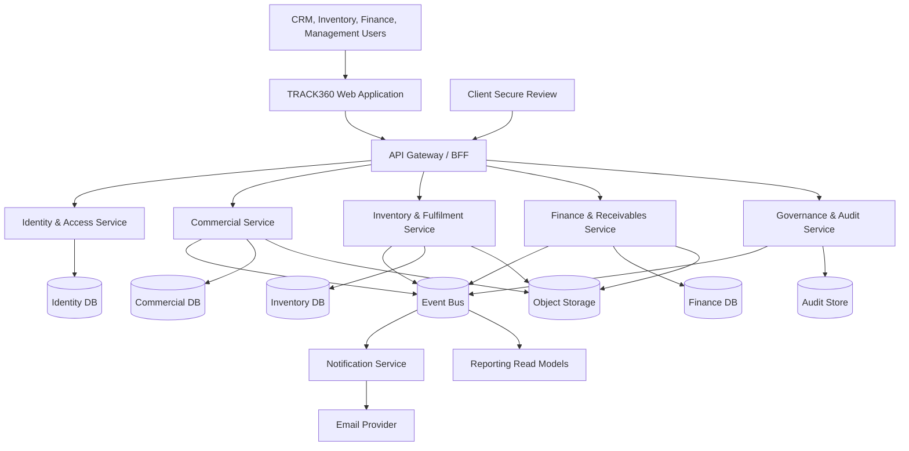

# TRACK360 ERP Target Architecture

**Architecture style:** Unified web application with domain-aligned microservices  
**Frontend:** React, TypeScript, Vite  
**Backend baseline:** Node.js, Express, PostgreSQL  
**Target:** Independently deployable services behind one API gateway

## 1. Architecture Statement

TRACK360 presents one application and one login to users. Microservices are an internal engineering boundary, not separate user-facing portals.

The four user workspaces are authorization and experience boundaries:

- Client & Commercial;
- Inventory & Fulfilment;
- Finance & Receivables;
- Management & Governance.

The backend is divided by business capability and data ownership. A service owns its state and publishes business events. Other services consume those events instead of reading or writing the owning service's tables directly.

## 2. Current And Target State

### Current implementation

- React/Vite frontend in `erp-2`;
- Node/Express backend in `erp-1`;
- PostgreSQL database;
- domain-oriented modules already exist for authentication, CRM, Inventory, Finance, Invoicing, Notifications, and Audit;
- synchronous REST integration and a shared database.

### Target implementation

- one web frontend;
- API Gateway / Backend-for-Frontend;
- independent domain services;
- database/schema ownership per service;
- event-driven cross-service handoffs;
- centralized identity, authorization, observability, and audit correlation;
- staged extraction that preserves current behavior during migration.

This document does not claim the current code is already physically deployed as microservices.

## 3. System Context



## 4. Service Boundaries

## 4.1 API Gateway / Backend-for-Frontend

Responsibilities:

- expose one stable `/api` surface to the web application;
- authenticate sessions and forward trusted identity claims;
- route requests to owning services;
- aggregate management dashboard read models;
- apply rate limits, request IDs, size limits, and security headers;
- never contain domain business rules.

## 4.2 Identity & Access Service

Owns:

- users;
- password credentials;
- roles and permissions;
- user-role assignments;
- sessions/refresh tokens;
- account state and forced password change;
- authentication audit events.

Canonical role keys:

- `csr_officer`;
- `inventory_officer`;
- `finance_officer`;
- `super_admin`.

Permissions are action-based, for example `quotation.submit`, `quotation.approve`, `stock.receive`, `reconciliation.confirm`, and `invoice.issue`.

## 4.3 Commercial Service

Owns:

- client master;
- contacts and addresses;
- client requirements;
- quotation and quotation lines;
- quotation versioning;
- management approval state;
- secure client review token and client decision;
- sales order release.

Publishes:

- `quotation.submitted.v1`;
- `quotation.management-approved.v1`;
- `quotation.revision-requested.v1`;
- `quotation.client-accepted.v1`;
- `sales-order.released.v1`.

Consumes relevant identity and notification outcomes, but does not read Inventory or Finance tables.

## 4.4 Inventory & Fulfilment Service

Owns:

- product master and dynamic attributes;
- selling price for operational display;
- restricted purchasing cost history;
- vendors;
- warehouses, rooms, and racks;
- stock balances and reservations;
- serialized and batch inventory;
- fulfilment tokens;
- purchase orders and goods receipts;
- material issue;
- field service assignments;
- client sign-off metadata/evidence reference;
- field reconciliation;
- stock movement ledger.

Publishes:

- `fulfilment.tokenized.v1`;
- `stock.shortage-detected.v1`;
- `purchase-order.issued.v1`;
- `goods-receipt.posted.v1`;
- `fulfilment.ready.v1`;
- `field-service.completed.v1`;
- `field-reconciliation.confirmed.v1`;
- `billing-record.submitted.v1`.

Consumes `sales-order.released.v1` idempotently.

## 4.5 Finance & Receivables Service

Owns:

- billing review;
- invoice and invoice lines;
- invoice versions and adjustment audit;
- tax calculation snapshot;
- currency and exchange-rate snapshot;
- payment receipts and allocations;
- receivable status;
- finance summaries and accounting references.

Publishes:

- `billing-record.approved.v1`;
- `billing-record.correction-requested.v1`;
- `invoice.issued.v1`;
- `invoice.adjusted.v1`;
- `payment.received.v1`;
- `invoice.overdue.v1`.

Consumes `billing-record.submitted.v1` idempotently.

## 4.6 Governance & Audit Service

Owns:

- append-only material action audit;
- approval audit projections;
- system configuration history;
- security and access events;
- cross-service correlation search;
- retention policies.

It does not become the primary store for operational records. It retains immutable audit facts and searchable projections.

## 4.7 Notification Service

Responsibilities:

- email templates and delivery;
- event-driven notifications;
- retry policy and dead-letter handling;
- delivery status and provider response;
- secure links supplied by the owning service;
- no ownership of quotation or invoice state.

Email failure never rolls back an approved quotation. Delivery is an independently retryable side effect.

## 4.8 Reporting Read Models

Management and summary dashboards read from projections built from business events. They do not execute cross-service transactional joins at request time.

Read models include:

- management control tower;
- inventory operations summary;
- finance monthly summary;
- end-to-end transaction timeline;
- client 360 view.

## 5. Data Ownership

| Entity | Owning service | External reference only in other services |
|---|---|---|
| User, role, permission | Identity & Access | `user_id`, role/permission claims |
| Client | Commercial | `client_id`, approved display snapshot |
| Requirement | Commercial | `requirement_id` |
| Quotation | Commercial | `quotation_id`, number, approved version and commercial snapshot |
| Sales order | Commercial | `order_id`, order number and released snapshot |
| Product and vendor | Inventory & Fulfilment | `product_id`, `vendor_id`, approved line snapshot |
| Stock, token, PO, receipt | Inventory & Fulfilment | source IDs and immutable document snapshots |
| Field service and reconciliation | Inventory & Fulfilment | `field_assignment_id`, `reconciliation_id`, billing snapshot |
| Invoice and payment | Finance & Receivables | `invoice_id`, `payment_id`, issued document snapshot |
| Audit event | Governance & Audit | source service, entity type/id, correlation ID |

No service writes directly to another service's database.

## 6. Canonical Record Chain

`REQ -> QT -> APR -> ORD -> TKN -> PO? -> FSA -> REC -> INV -> PAY`

Each record has:

- UUID primary identifier;
- human-readable number;
- tenant/company identifier if multi-company support is introduced;
- version;
- status;
- created/updated actor and timestamp;
- correlation ID;
- source record identifiers;
- idempotency key for creation/transition commands.

Human-readable numbers are display references and must not be used as primary keys.

## 7. Integration Model

### Synchronous calls

Use synchronous REST for:

- user-initiated reads;
- command validation requiring immediate feedback within one service;
- reference lookup where short-lived caching is acceptable;
- secure client review commands.

### Asynchronous events

Use events for:

- cross-service handoffs;
- notification requests;
- reporting projections;
- audit ingestion;
- long-running document or export generation.

### Event contract

```json
{
  "event_id": "uuid",
  "event_type": "sales-order.released.v1",
  "occurred_at": "ISO-8601 timestamp",
  "source": "commercial-service",
  "correlation_id": "uuid",
  "causation_id": "uuid",
  "actor": { "user_id": "uuid", "role": "csr_officer" },
  "entity": { "type": "sales_order", "id": "uuid", "version": 3 },
  "data": {}
}
```

Events are versioned. Consumers ignore duplicate `event_id` values and preserve processing outcomes.

## 8. Transaction And Consistency Strategy

- A service completes its local state change and outbox insert in one database transaction.
- An outbox publisher sends committed events to the event bus.
- Consumers store an inbox/processed-event record before applying an event.
- Cross-service workflows use state machines and compensating actions, not distributed database transactions.
- The UI shows `Processing` when a cross-service handoff is committed but the downstream projection is not yet ready.
- Reconciliation and invoice issue use immutable snapshots so later master-data edits do not rewrite historical documents.

## 9. API Standards

Base format:

- `/api/v1/clients`
- `/api/v1/quotations`
- `/api/v1/sales-orders`
- `/api/v1/products`
- `/api/v1/purchase-orders`
- `/api/v1/field-service-assignments`
- `/api/v1/reconciliations`
- `/api/v1/invoices`

Requirements:

- JSON request/response contracts validated with Zod or OpenAPI-generated schemas;
- consistent envelope for data, pagination, and errors;
- `Idempotency-Key` on record creation and irreversible transitions;
- `If-Match` or version field on concurrent edits;
- correlation ID returned in response headers;
- no raw database errors returned to clients;
- server-side filtering, sorting, and pagination;
- UTC timestamps in APIs and database, localized in the UI.

Example error:

```json
{
  "error": {
    "code": "QUOTATION_MANAGEMENT_APPROVAL_REQUIRED",
    "message": "Management approval is required before client review.",
    "field_errors": [],
    "correlation_id": "uuid"
  }
}
```

## 10. Authentication And Authorization

1. User submits credentials to Identity & Access.
2. The service verifies account status and password.
3. The session contains user ID, active role, permission version, and expiry.
4. The gateway validates the session and forwards signed identity context.
5. Every service authorizes the requested action.
6. The frontend renders only permitted workspace routes and actions.

Security requirements:

- `HttpOnly`, `Secure`, `SameSite` cookies for browser sessions where applicable;
- bcrypt/Argon2 password hashing;
- login throttling and lockout controls;
- CSRF protection for cookie-based state-changing requests;
- short-lived service credentials and secret rotation;
- field-level cost visibility enforced in backend serialization;
- signed, expiring, single-purpose client review tokens.

## 11. Database Strategy

### Target isolation

Each service has an owned PostgreSQL database or schema and an independent migration history. Separate databases are preferred once services are independently deployed.

### Migration from shared database

1. Define table ownership and prohibit new cross-domain writes.
2. Introduce service repositories behind current modules.
3. Add outbox and inbox tables.
4. Replace cross-module table reads with APIs or projections.
5. Move an owned schema to a separate database.
6. Extract the module into an independent process.
7. Repeat service by service.

Do not split the database before ownership and event contracts are stable.

## 12. Deployment Topology

Recommended components:

- CDN/static hosting for React assets;
- reverse proxy/API gateway;
- containerized Node services;
- managed PostgreSQL per service or isolated schemas during transition;
- Redis for short-lived caching, rate limits, and distributed locks where necessary;
- RabbitMQ, NATS, or managed event bus;
- S3-compatible object storage for product images, sign-off evidence, and generated documents;
- background workers for email, PDF, exports, and projections.

Development may run services through Docker Compose while preserving one frontend URL.

## 13. Observability

Every request and event includes a correlation ID.

Collect:

- structured JSON logs;
- request rate, latency, and error metrics;
- database and event-bus health;
- outbox backlog and dead-letter count;
- authentication failures;
- business metrics such as approval age, stock shortage age, reconciliation age, and invoice cycle time;
- distributed traces across gateway and services.

Operational alerts must identify the affected service, correlation ID, and recovery action without exposing secrets or personal data.

## 14. Resilience

- timeouts on every network call;
- bounded retries with exponential backoff and jitter;
- circuit breakers for non-critical providers;
- idempotent consumers and commands;
- dead-letter queues with replay tooling;
- graceful degradation for email and reporting;
- health, readiness, and liveness endpoints;
- point-in-time database recovery;
- tested disaster-recovery runbook.

Core transactions must not depend on email or reporting availability.

## 15. Performance And Scale

- stateless API instances scale horizontally;
- database indexes support status, date, client, source reference, SKU, serial, warehouse, and invoice filters;
- cursor or indexed offset pagination for large lists;
- document and image processing is asynchronous;
- summary dashboards use projections or materialized read models;
- large exports are generated as background jobs with expiring download links;
- product images are resized and served through object storage/CDN.

## 16. Testing Strategy

| Layer | Required coverage |
|---|---|
| Unit | Calculations, transition guards, permission rules, serializers |
| Service integration | PostgreSQL transactions, repositories, outbox, idempotency |
| Contract | Provider/consumer event and REST compatibility |
| Frontend component | forms, conditional fields, role actions, responsive states |
| End-to-end | four-role journey from requirement through invoice/payment |
| Security | unauthorized routes, object-level access, cost leakage, token expiry |
| Performance | dashboards, searches, document generation, event backlog |
| Recovery | retry, duplicate event, provider outage, failed handoff, replay |

An end-to-end test must use unique record suffixes and clean up only its own data.

## 17. Staged Delivery Plan

### Phase 1: Domain hardening

- canonical terminology;
- role-based routes and API authorization;
- explicit status machines;
- idempotency keys;
- audit fields and migration discipline;
- no direct cross-module writes outside service boundaries.

### Phase 2: Event foundation

- outbox/inbox implementation;
- versioned event contracts;
- notification worker;
- management and summary projections;
- correlation IDs and structured logs.

### Phase 3: Service extraction

Recommended order:

1. Notification Service;
2. Reporting Read Models;
3. Identity & Access Service;
4. Finance & Receivables Service;
5. Inventory & Fulfilment Service;
6. Commercial Service and gateway finalization.

Extraction order may change based on operational risk, but the unified URL and user journey remain unchanged.

## 18. Architecture Decisions

1. **One frontend, multiple services:** role workspaces remain within one application shell.
2. **Roles are not services:** service boundaries follow data ownership, not sidebar sections.
3. **No fifth Installer role:** field resources are managed within Inventory in the current product baseline.
4. **Management approval precedes client review:** the system never sends an unapproved commercial commitment.
5. **Client acceptance precedes order release:** Inventory receives only accepted, released work.
6. **Purchasing cost is restricted at the API:** UI hiding alone is insufficient.
7. **Historical documents use snapshots:** master-data edits do not alter issued documents.
8. **Cross-service consistency is event-driven:** local transactions plus outbox replace distributed transactions.
9. **Current modular monolith evolves gradually:** no big-bang rewrite.
