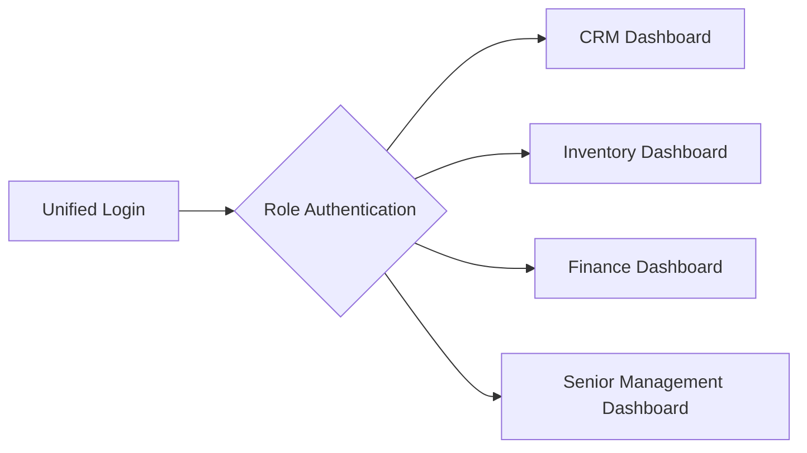
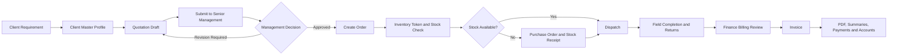
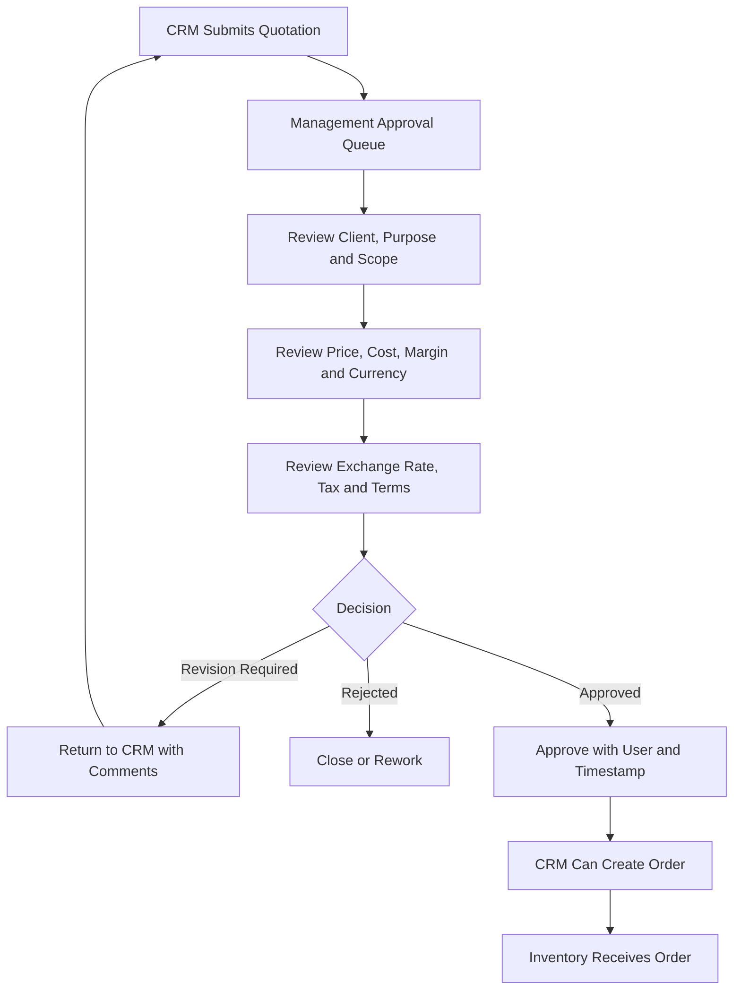

# TRACK360 ERP - Unified Platform User Journey

**Prepared for:** Electronic Safety & Security (Pvt.) Ltd. (ESSPL)  
**Purpose:** Management presentation and future system design reference  
**Operating model:** One unified platform with four role-based workspaces  
**Updated:** 19 September 2026

---

## 1. Operating Model

TRACK360 ERP will use one login page and one shared database. The system will identify the user's role after successful authentication and open the correct workspace automatically.

| Role | Workspace Shown After Login | Primary Responsibility |
|---|---|---|
| CRM Officer | CRM Dashboard | Client records, service requirements, quotations, and approved order creation |
| Inventory Officer | Inventory Dashboard | Stock checks, purchasing, receiving, dispatch, field completion, and returns |
| Finance Officer | Finance Dashboard | Billing review, invoices, summaries, payments, and accounts |
| Senior Management / Super Admin | Management Dashboard | Quotation approval, user access, cross-department monitoring, controls, and audit review |

Users will see only the menus, records, dashboard widgets, and actions required for their work. Backend authorization will apply the same restrictions as the interface.

---

## 2. Role-Based Dashboard Experience

### CRM Dashboard

- New client inquiries
- Clients added this month
- Draft quotations
- Quotations awaiting management approval
- Quotations returned for revision
- Approved quotations ready for order creation
- Recent orders created from approved quotations
- Quick actions: Add Client, Create Quotation, Submit for Approval

### Inventory Dashboard

- New approved orders awaiting token generation
- Orders with complete stock
- Orders with stock shortages
- Open purchase orders and expected deliveries
- Stock receipts pending confirmation
- Jobs ready for dispatch
- Active field jobs
- Returns awaiting reconciliation
- Low stock alerts and recent stock movements

### Finance Dashboard

- Bills awaiting review
- Approved bills ready for invoice generation
- Invoices issued this month
- Outstanding receivables
- Paid and overdue invoices
- Sales tax totals
- Monthly billing summary
- Expense type and client breakdown

### Senior Management / Super Admin Dashboard

- Quotations awaiting approval
- High value quotations
- Quotations with low margin or special pricing
- Orders waiting for stock or dispatch
- Purchase commitments
- Pending Finance approvals
- Revenue, receivables, stock exposure, and operational alerts
- User access, system logs, configuration, and existing EMS modules

---

## 3. Complete User Journey

**Release control:** Inventory will not receive the order until Senior Management approves the quotation and CRM creates the order.

---

## 4. CRM Workflow

1. CRM Officer logs in and opens the CRM Dashboard.
2. CRM Officer searches the client list before creating a new record.
3. CRM Officer creates one Client Master Profile if the client does not exist.
4. CRM Officer creates a quotation for a defined company, request, project, branch, or service requirement.
5. CRM Officer selects catalog items, service lines, or custom lines.
6. CRM Officer selects the quotation currency and enters the exchange rate when foreign currency applies.
7. CRM Officer selects the tax method and reviews all calculated totals.
8. CRM Officer saves the quotation as a draft or submits it to Senior Management.
9. Senior Management approves, rejects, or returns the quotation for revision.
10. CRM Officer converts only an approved quotation into an order.
11. The order moves automatically to the Inventory Dashboard.

---

## 5. Client Master Profile Fields

The Client Master Profile stores stable client information once. Quotations and invoices will reference this record instead of repeating the same fields.

| Section | Field | Options / Rule |
|---|---|---|
| Classification | Client Type | Individual, Company, Group of Companies, Government Organization, NGO / Non-profit |
| Classification | Industry / Sector | Banking, Corporate, Retail, Education, Healthcare, Government, Residential, Industrial, Other |
| Identity | Client / Trading Name | Required for organizations |
| Identity | Legal Registered Name | Optional and shown only when different from the trading name |
| Identity | Full Name | Required for individual clients |
| Tax | NTN | Optional according to client type |
| Tax | GST Registration Number | Optional according to client type |
| Contact | Primary Contact Person | Name and designation |
| Contact | Email | Main commercial email |
| Contact | Phone | Main contact number |
| Address | Billing Address | Used for commercial documents |
| Address | Default Service Address | Used as the default installation or delivery location |
| Commercial | Default Currency | PKR, USD, or configured currency |
| Commercial | Default Payment Terms | Advance, credit days, milestone, or other approved terms |
| Requirement | Service Categories | Product Supply / Procurement, Security & Surveillance, HR & Staffing, Technical Support, AMC / Maintenance, IT & Cybersecurity, Rental / Leasing, Consultancy / Projects, Other |
| Requirement | Requirement Summary | High-level client need without repeating quotation line descriptions |

### No-duplication rule

- Client name, contact, tax identity, and billing address belong to the Client Master Profile.
- Branch, site, project, service scope, currency, exchange rate, tax treatment, and commercial lines belong to the quotation.
- Invoice fields will pull approved information from the client and quotation records.

---

## 6. Quotation Purpose and Commercial Fields

Each quotation must clearly identify who it is for, why it is being prepared, what ESSPL will provide, and how the price is calculated.

| Section | Field | Behaviour |
|---|---|---|
| Reference | Quotation Number | System-generated `QT` number |
| Customer | Client / Company | Selected from Client Master Profile |
| Customer | Branch / Site | Selected or entered for this requirement |
| Purpose | Quotation Subject | Short commercial title |
| Purpose | Request / Project Reference | Tender, inquiry, request, project, or internal client reference |
| Purpose | Service Category | Product Supply, Security, HR, Maintenance, IT, Rental, Consultancy, or Other |
| Purpose | Scope / Description | Clear description of the requirement |
| Validity | Quotation Date | Document creation date |
| Validity | Valid Until | Commercial validity date |
| Currency | Currency | PKR, USD, or configured currency |
| Currency | Exchange Rate | Manually entered when foreign currency applies |
| Currency | Exchange Rate Date / Source | Records when and how the rate was selected |
| Currency | Rate Note | `Exchange rate may vary according to the market rate at the time of billing.` |
| Tax | Tax Method | Tax Exclusive, Tax Inclusive, or No Tax |
| Tax | Tax Rate | Preset or authorized custom percentage |
| Terms | Payment Terms | Selected approved terms |
| Terms | Delivery / Mobilization Period | Expected supply or service start period |
| Terms | Warranty / Service Terms | Applicable commercial commitment |
| Approval | Prepared By | CRM user |
| Approval | Approval Status | Draft, Submitted, Revision Required, Approved, Rejected |
| Approval | Approved By / Date | Senior Management user and timestamp |

### Quotation line fields

- Item or service code
- Model / brand where applicable
- Description
- Unit of measure
- Quantity
- Unit price in selected currency
- PKR equivalent when foreign currency applies
- Discount, if authorized
- Value excluding tax
- Tax amount
- Value including tax

---

## 7. Quotation and Invoice Document Format

Quotation and invoice documents will use the same approved commercial layout so clients see consistent information.

| Shared Layout Section | Quotation | Invoice |
|---|---|---|
| Document title | **Quotation** | **Invoice** or approved invoice title |
| Document number | QT number | INV number |
| Client information | Pulled from Client Master Profile | Pulled from approved order and Client Master Profile |
| Branch / site | Quotation-specific | Order / dispatch-specific |
| Line item table | Proposed items and services | Delivered and billable items |
| Currency and exchange rate | Proposed commercial rate | Billing rate according to approved policy |
| Tax | Proposed tax treatment | Final tax treatment |
| Totals | Proposed total | Final payable total |
| Terms | Validity, delivery, payment, warranty | Payment and invoice terms |
| Approval | Senior Management approval | Finance authorization |

---

## 8. Senior Management Approval Workflow

Senior Management dashboard should show quotation value, currency, PKR equivalent, estimated cost, gross margin, tax, payment terms, validity, and any exception from standard pricing.

---

## 9. Inventory Workflow

1. Inventory Officer logs in and sees only the Inventory workspace.
2. Approved orders appear in Incoming Orders.
3. Inventory generates a token and the system checks stock.
4. Available stock moves the job to Dispatch Ready.
5. Stock shortage opens the Purchase Order workflow with shortage lines pre-filled.
6. Inventory selects the supplier, expected delivery, purchasing tax, quantities, and costs.
7. Inventory confirms physical stock receipt.
8. The system updates stock, the movement ledger, and job readiness.
9. Inventory selects the ready job, installer, service address, items, and dispatch notes.
10. The field result records installed items, unused returns, and approved extras.
11. Inventory reconciles physical returns before sending the final bill to Finance.

### Inventory dashboard and field groups

- Incoming approved orders
- Token and stock readiness
- Product and service inventory
- Purchase orders and suppliers
- Stock receipt
- Serial / barcode tracking
- Dispatch and installer assignment
- Field completion
- Returns and condition
- Stock movement ledger
- Low stock alerts

---

## 10. Finance Workflow

1. Finance Officer logs in and sees only the Finance workspace.
2. Completed or reconciled jobs appear in Billing Approvals.
3. Finance reviews installed lines, returned value, extras, currency, tax, and final payable amount.
4. Finance approves the bill or returns it with a correction note.
5. The system generates the invoice in the same approved commercial format as the quotation.
6. Finance may edit authorized invoice fields without changing the operational history.
7. Finance prints or saves the invoice as PDF.
8. Issued invoices feed monthly summaries, payment status, receivables, and accounts.

### Finance dashboard and field groups

- Pending billing approvals
- Invoice generation queue
- Draft, issued, paid, overdue, and voided invoices
- Client and expense type summaries
- Currency and exchange rate reporting
- Sales tax reporting
- Receivables and payment status
- General ledger and financial review

---

## 11. Data Handoffs

| From | Trigger | To | Information Carried Forward |
|---|---|---|---|
| CRM | Senior Management approves quotation and CRM creates order | Inventory | Client ID, site, service category, approved lines, quantities, currency, exchange rate, tax, totals, QT and ORD |
| Inventory | Stock shortage confirmed | Purchase Order | Product / service references, shortage quantity, preferred supplier where configured, ORD and TKN |
| Inventory | Job completed and returns reconciled | Finance | Installed lines, deductions, extras, currency, tax, adjusted total, ORD, TKN, DSP and RTN |
| Finance | Invoice issued | Summaries and Accounts | Client, document references, taxable values, tax, total, currency, payment status and INV |

---

## 12. Access and Audit Controls

- One user account will have one or more explicitly assigned roles.
- Menus, dashboards, actions, and API permissions will follow the assigned role.
- Senior Management approval will record approver, date, comments, and the approved version.
- CRM cannot convert a draft, submitted, rejected, or revision-required quotation into an order.
- Inventory cannot dispatch an order without approval, order creation, token generation, and complete stock.
- Finance cannot invoice an incomplete job or an unreconciled return.
- Every material action will create an audit record.
- Each record will retain its upstream references: `QT`, `ORD`, `TKN`, `PO`, `DSP`, `RTN`, and `INV`.

---

## 13. Final Operating Principle

**CRM prepares the commercial proposal. Senior Management approves the commitment. Inventory executes the approved work. Finance invoices the verified result.**

The platform will maintain one source of truth while giving each role a focused workspace.

