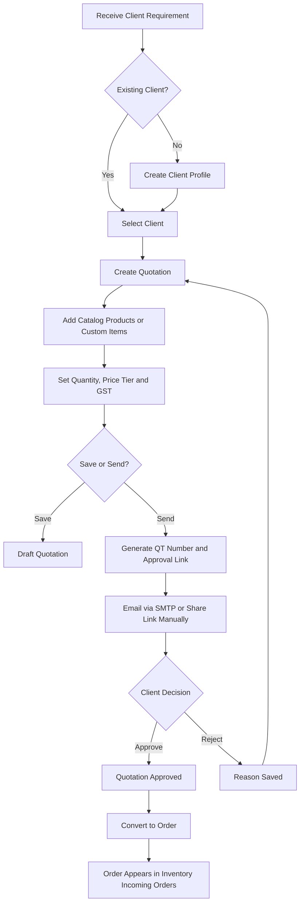
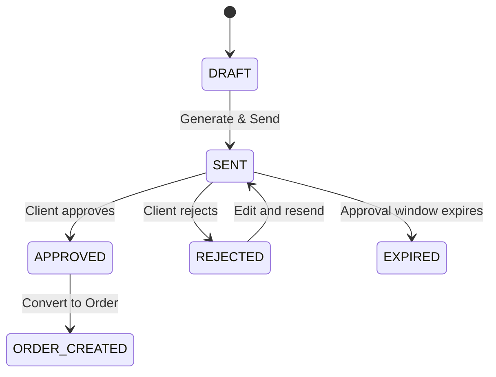
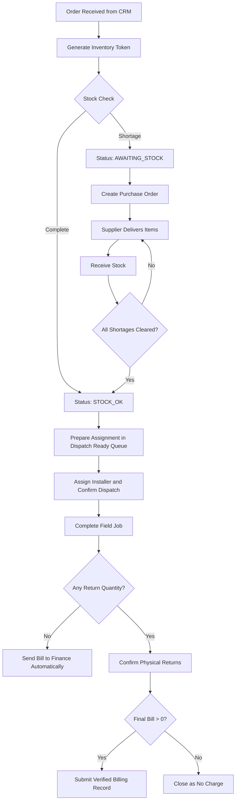
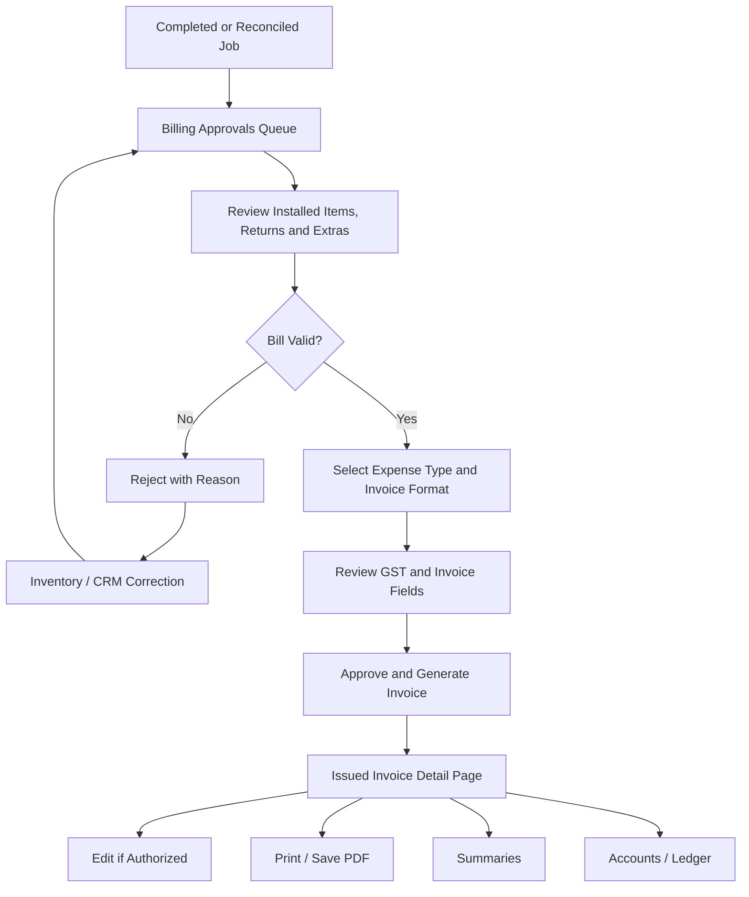
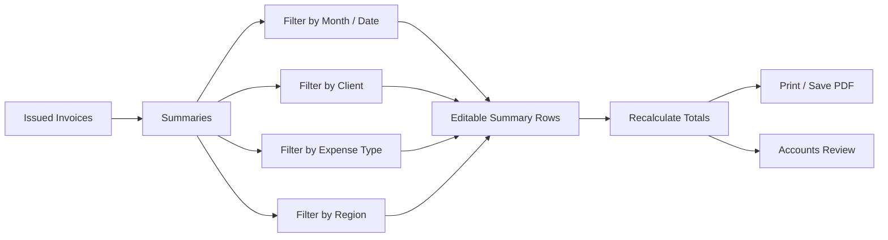
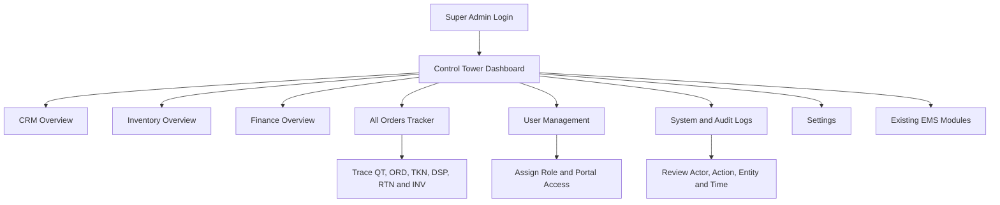

# TRACK360 ERP User Journey and Field Workflow

**Prepared for:** Electronic Safety & Security (Pvt.) Ltd. (ESSPL)  
**System:** TRACK360 ERP  
**Purpose:** Company presentation, operating procedure alignment, user onboarding, and workflow validation  
**Document language:** English  
**Updated:** 19 September 2026

---

## 1. Executive Overview

TRACK360 ERP connects the complete commercial and operational lifecycle of ESSPL in one controlled workflow. A client requirement begins in CRM, becomes an approved quotation and order, moves to Inventory for stock allocation and field execution, and reaches Finance only after the actual site result has been reconciled. Super Admin provides cross-portal governance, user access control, monitoring, and audit visibility.

The system has **four primary portals**:

1. **CRM Portal** - client profiles, requirements, quotations, approval, and order conversion.
2. **Inventory Portal** - tokenization, stock checking, purchasing, receiving, field service dispatch, completion, and returns.
3. **Finance Portal** - billing approval, invoice generation, invoice management, summaries, and accounts.
4. **Super Admin Portal** - users, permissions, cross-portal monitoring, logs, settings, and existing EMS modules.

> **Important operating rule:** Installer field activity is a limited workflow inside Inventory. It is not counted as a separate fifth portal.

---

## 2. Role and Access Model

| User / Role | Primary Workspace | Main Responsibility | Restricted From |
|---|---|---|---|
| CRM Officer (`csr_officer`) | CRM | Register clients, prepare quotations, manage client approval, convert approved quotations to orders | Inventory stock control, Finance approval, Admin controls |
| Inventory Officer (`inventory_officer`) | Inventory | Generate tokens, check stock, create/receive purchase orders, dispatch jobs, reconcile field results and returns | CRM quotation approval, Finance invoice approval, Admin user management |
| Installer / Field User | Inventory field workflow | View assigned work, record installed or unused items, submit completion and returns | Inventory dashboard, catalog management, purchasing, master setup, Finance |
| Finance Officer (`finance_officer`) | Finance | Review final bills, generate invoices, maintain summaries and accounts | CRM quotation editing, stock operations, Admin controls |
| Joint Inventory and Finance Admin (`inv_fin_admin`) | Inventory + Finance | Perform authorized inventory and finance operations | Super Admin governance unless separately authorized |
| Super Admin (`super_admin`) | All portals + EMS | User access, monitoring, audit, settings, exception oversight, and all authorized operational modules | None within assigned system scope |
| External Client | Public approval page | Review and approve or reject a quotation | Internal ERP portals and records |

---

## 3. End-to-End Business Journey

```mermaid
flowchart LR
    A[Client Requirement] --> B[CRM Client Profile]
    B --> C[Quotation and GST]
    C --> D[Client Approval Link]
    D -->|Approved| E[Convert to Order]
    D -->|Rejected| C
    E --> F[Inventory Token]
    F --> G{Stock Available?}
    G -->|Yes| H[Dispatch Ready]
    G -->|No| I[Purchase Order]
    I --> J[Receive Stock]
    J --> H
    H --> K[Installer / Field Execution]
    K --> L{Unused or Returned Items?}
    L -->|No| M[Automatic Finance Handoff]
    L -->|Yes| N[Inventory Return Reconciliation]
    N --> O{Final Amount Above Zero?}
    O -->|Yes| M
    O -->|No| P[Close as No Charge]
    M --> Q[Finance Billing Approval]
    Q --> R[Issued Invoice]
    R --> S[PDF / Print]
    R --> T[Summaries and Accounts]
```

### Record lineage

`Client -> QT Quotation -> ORD Order -> TKN Token -> PO Purchase Order (if required) -> DSP Dispatch -> RTN Return (if required) -> INV Invoice`

Every downstream record must retain its upstream reference. Operators should identify work by both client name and record number.

---

## 4. CRM Portal Journey

### 4.1 CRM operating flow

### 4.2 Client profile fields

| Section | Field | Type / Options | Rule |
|---|---|---|---|
| Identity | Client Category | Individual / Personal; Organization / Company; Group of Companies; Government Organization; Non-profit / NGO | Required; determines which identity fields are shown |
| Identity | Client / Trading Name | Text | Required for organizations |
| Identity | Full Name | Text | Required for individuals |
| Identity | Legal Registered Name | Text | Optional; shown for non-individual clients and should not duplicate the trading name |
| Organization | Organization Type | Bank / Financial Institution; Corporate; SME; Retail; Education; Healthcare; Government Department; NGO; Other | Required for organizational clients |
| Contact | Primary Contact Person | Text | Main operational contact |
| Contact | Alternate Contact | Text | Optional backup contact |
| Contact | Email | Valid email | Required for automated quotation email delivery |
| Contact | Phone | Telephone / mobile | Required operational contact |
| Location | Billing / Branch Address | Multi-line text | Used on quotation and invoice where applicable |
| Location | Service / Installation Address | Multi-line text | Used for field dispatch; may differ from billing address |
| Requirement | Services Required | Multi-select | Security & Surveillance; HR & Staffing; Maintenance & Technical Support; IT & Cybersecurity; Equipment Rental / Leasing; Product Supply Only; Consultancy / Project Services; Other |
| Requirement | Service Requirement / Scope | Multi-line text | Describes what the client needs; this is not automatically a billable line item |

### 4.3 Quotation fields

| Section | Field | Behaviour |
|---|---|---|
| Client | Select Client | Searchable dropdown; typing letters filters the saved client list; newly saved clients appear after refresh/reload |
| Pricing | Price Tier | Tier A / Standard; Tier B / Corporate; Tier C / Government; Tier D / Special |
| Tax | GST Rate | No GST, preset rate, or custom percentage; totals recalculate immediately |
| Format | Quotation / Invoice Template | Selects the approved commercial format, such as HBL Sale Tax Invoice |
| Notes | Internal CRM Note | Internal operational context; not a replacement for a quotation line |
| Line Item | Add Product | Selects an existing catalog product and auto-fills the applicable price |
| Line Item | Add Custom Item | Adds a non-catalog service or purchase-required item with manual description, quantity, and price |
| Line Item | Quantity | Positive numeric quantity |
| Line Item | Unit Price | Auto-filled for catalog products; editable only where business rules allow |
| Calculation | Subtotal / GST / Grand Total | Automatically calculated from quotation lines and selected GST |

### 4.4 CRM actions and outcomes

| Action | System Outcome | Next User Step |
|---|---|---|
| Save as Draft | Saves client, quotation header, and lines with `DRAFT` status | Continue editing later; no client email is sent |
| Generate & Send | Generates a `QT` number, saves all data, creates a public approval link, and attempts SMTP delivery | Check email delivery result or copy the client link |
| Copy Client Link | Copies the public review URL | Share manually when SMTP is unavailable |
| Client Approves | Saves `APPROVED` decision and audit trail | CRM Officer converts quotation to an order |
| Client Rejects | Saves `REJECTED` decision and mandatory reason | CRM Officer edits and resends the quotation |
| Convert to Order | Generates an `ORD` record linked to the quotation | Inventory Officer opens Incoming Orders |

### 4.5 CRM status model

Quotation status and email delivery status are separate. A quotation may be `SENT` while email delivery is `FAILED`; the manually shared approval link remains available.

---

## 5. Inventory Portal Journey

### 5.1 Inventory decision flow

### 5.2 Incoming order and token fields

| Field | Source / Behaviour |
|---|---|
| Client | Auto-generated from approved CRM order |
| Order Number | Auto-generated `ORD` reference |
| Quotation Number | Linked `QT` reference |
| Ordered Items | Auto-generated from approved quotation lines |
| Required Quantity | Auto-generated from the order |
| Available Quantity | Calculated from current stock |
| Shortage Quantity | Required minus available quantity |
| Token Number | Auto-generated `TKN` reference after Generate Token |
| Stock Readiness | `STOCK_OK` or `AWAITING_STOCK` |

### 5.3 Purchase order fields

| Field | Behaviour |
|---|---|
| Supplier | Select the vendor from whom ESSPL will purchase; the client is not the supplier |
| Suggested Supplier | May be auto-selected from product/vendor configuration and remains reviewable |
| PO Date | Defaults to current operating date |
| Expected Delivery | Required delivery commitment date |
| GST % | Adjustable by the Inventory Officer according to supplier terms |
| PO Items | Pre-filled with shortage items from the linked order |
| Add / Remove Item | Allows controlled changes before the PO is saved |
| Quantity | Purchase quantity for each line |
| Unit Cost | Supplier cost per unit |
| Line Total | Quantity multiplied by unit cost |
| Subtotal / GST / Grand Total | Auto-calculated |
| Source References | Client, `ORD`, `QT`, and `TKN` remain visible |

### 5.4 Receiving stock

1. Open the applicable PO and select **Receive Stock**.
2. Enter the physically received quantity for each item.
3. Confirm receipt only after the goods are available for issue.
4. The system updates stock balances, movement history, PO status, and the linked order's readiness.
5. A fully received PO shows `RECEIVED`; its Receive Stock button becomes disabled and visually muted.
6. When all shortages are cleared, the linked job appears in the Dispatch Ready Queue.

### 5.5 Dispatch fields

| Field | Source / Behaviour |
|---|---|
| Selected Job | Chosen from `STOCK_OK` jobs in the Ready Queue |
| Client | Auto-filled from order |
| Order / Token | Auto-filled `ORD` and `TKN` references |
| Site / Branch Address | Auto-filled from client/order; reviewed before dispatch |
| Installer | Selected from authorized field users |
| Dispatch Items | Auto-filled from the selected job |
| Required / Available Quantity | Displayed for final issue validation |
| Unit Price | Carried for downstream billing control |
| Dispatch Notes | Optional field instructions |
| Dispatch Number | Auto-generated `DSP` reference on confirmation |

### 5.6 Field completion and return workflow

For each issued item, the field user or authorized Inventory Officer records the actual result:

| Result | Meaning | Stock / Billing Effect |
|---|---|---|
| Installed / Given | Item was installed, handed over, or consumed at the client site | Remains chargeable and is included in the final bill |
| Not Used / Return | Item was not used and is physically returned | Enters Inventory Returns for quantity and condition confirmation |
| Extra Item | Additional approved item was used during the job | Added to the adjusted bill and tracked as an extra line |

If there are no physical returns and the final amount is above zero, completion may send the bill directly to Finance. If returns exist, Inventory confirms quantity and condition first. Good returned stock becomes available again; damaged or used stock must not be treated as available.

### 5.7 Inventory return fields

| Field | Behaviour |
|---|---|
| Return Number | Auto-generated `RTN` reference |
| Item Name | Linked to dispatched item |
| Issued Quantity | Read-only source quantity |
| Quantity Returned | Actual physical return quantity; zero means no return |
| Condition | Good, damaged, used, or other configured condition |
| Confirm | Inventory verification checkbox / action |
| Original Installed / Given Amount | Chargeable amount before returns |
| Returns Deducted | Value removed due to confirmed returns |
| Extra Items Added | Value of approved extra items |
| Final Adjusted Amount | Original minus returns plus extras |

### 5.8 Inventory status model

`PENDING_REVIEW -> READY_FOR_INVENTORY -> TOKEN_GENERATED -> STOCK_OK / AWAITING_STOCK -> DISPATCHED -> IN_PROGRESS -> RETURN_PENDING / COMPLETED -> RETURN_CONFIRMED / BILL_SENT / NO_CHARGE`

---

## 6. Finance Portal Journey

### 6.1 Finance operating flow

### 6.2 Billing approval fields

| Field | Source / Behaviour |
|---|---|
| Token / Order | Linked `TKN` and `ORD` references |
| Client | Auto-generated from the original order |
| Installed Items | Actual installed/given items from completion |
| Returns Deducted | Confirmed return value from Inventory |
| Extra Items Added | Approved site extras |
| Original Amount | Chargeable amount before reconciliation |
| Final Amount | Original minus returns plus extras, including applicable tax logic |
| Submitted Date | Finance handoff timestamp |
| Expense Type | Operational, Capital, Complex, Rental, or Footage |
| Invoice Format | Approved client-specific or standard format |
| Rejection Note | Required when Finance rejects the bill |

### 6.3 Invoice fields

| Section | Fields |
|---|---|
| Reference | Invoice Number, Reference Number, PO Number, Dispatch / D/C Number, FBR Invoice Number where applicable |
| Client | Client name, branch name, branch code, region, billing address |
| Tax Identity | NTN, GST number, selected GST rate |
| Dates | Invoice date and applicable approval / retrieval dates for specialized formats |
| Line Items | Model / brand, description, quantity, unit price, value excluding GST, GST amount, value including GST |
| Totals | Subtotal, tax, grand total, amount in words |
| Authorization | Prepared by and status |
| Status | Draft, Issued, Paid, Cancelled / Voided according to permission |

### 6.4 Finance actions and controls

| Action | Outcome |
|---|---|
| Approve & Generate Invoice | Generates an `INV` record and opens a separate invoice detail page |
| Reject Bill | Returns the bill with a visible reason for correction |
| Edit Invoice | Updates authorized invoice fields and recalculates totals |
| Print / Save PDF | Produces a clean invoice-only print layout without application navigation or browser-only control elements |
| Delete / Void | Available only where policy and permission allow; audit history is retained |
| Mark Paid | Updates payment status without changing the original operational history |

### 6.5 Summaries workflow

Summary rows may include invoice number, client, expense type, region, amount excluding tax, sales tax, amount including tax, and status. Any authorized edit or deletion must refresh aggregate totals.

---

## 7. Super Admin Journey

### 7.1 Governance workflow

### 7.2 Super Admin responsibilities

- Review combined KPIs, alerts, workload, stock shortages, pending bills, and issued invoices.
- Use dashboard page arrows to move between detailed operational views without overcrowding one screen.
- Create, activate, deactivate, and review users by role and portal group.
- Keep CRM, Inventory, Finance, joint access, and Super Admin permissions distinct.
- Trace an order from quotation to invoice through All Orders Tracker.
- Review system and audit logs; operational users must not edit audit history.
- Maintain company, inventory, role, and workflow settings.
- Continue using existing EMS modules such as Employees, Attendance, Leave, Penalties, Announcements, Calendar, and Directory.

---

## 8. Cross-Portal Handoff Rules

| From | Trigger | To | Data That Must Travel Automatically |
|---|---|---|---|
| CRM | Approved quotation converted to order | Inventory Incoming Orders | Client, addresses, contact, quotation, item lines, quantities, prices, GST, totals, notes, `QT`, `ORD` |
| Inventory Token | Stock shortage detected | Purchase Orders | Client/order reference, shortage items, required/available/shortage quantities, `ORD`, `QT`, `TKN` |
| Purchase Orders | Full stock received | Dispatch Ready Queue | Client, site address, complete item list, stock readiness, `ORD`, `TKN` |
| Dispatch | Job confirmed | Field completion | Installer, site, issued items, quantities, prices, `DSP`, `TKN`, `ORD` |
| Field Completion | No returns and bill above zero | Finance Billing Approvals | Installed items, extras, final amount, client, `DSP`, `TKN`, `ORD` |
| Inventory Returns | Returns confirmed and adjusted bill submitted | Finance Billing Approvals | Installed lines, deductions, extras, adjusted total, `RTN`, `DSP`, `TKN`, `ORD` |
| Finance Approval | Invoice generated | Invoices / Summaries / Accounts | Client, references, tax, final line values, status, `INV` |

---

## 9. Status and Exception Controls

| Situation | Correct System Response | User Action |
|---|---|---|
| Client email is not configured | Show a neutral manual-sharing message and retain the approval link | Copy and share the client link; configure SMTP before relying on email |
| Client rejects quotation | Save rejection reason and prevent order conversion | Edit and resend the quotation |
| Token shows `AWAITING_STOCK` | Keep the job out of dispatch and expose PO action | Create / receive the required PO |
| PO is fully received | Set status to `RECEIVED` and disable Receive Stock | Continue to Dispatch Ready Queue |
| Dispatch Ready Queue is empty | Explain whether token or stock action is pending | Check Incoming Orders and Purchase Orders |
| Installed item has zero return quantity | Keep it chargeable | Do not confirm it as returned |
| All chargeable items are returned | Final amount becomes zero and no payable invoice is generated | Close as No Charge |
| Finance cannot find a bill | Do not fabricate an invoice | Confirm job completion, return confirmation, and Finance handoff |
| Invoice print contains navigation or URLs | Use invoice-only print CSS and disabled browser headers/footers where appropriate | Re-open invoice detail and print again |

---

## 10. Data Integrity and Audit Requirements

1. Every action must persist to PostgreSQL before the UI reports success.
2. Every handoff must retain upstream identifiers and the acting user.
3. UI role restrictions must also be enforced by backend authorization.
4. Creation endpoints must protect against duplicate order, token, dispatch, return, and invoice generation.
5. Stock changes must create movement records; direct silent quantity changes are not acceptable.
6. Approvals, rejections, email delivery attempts, bill submission, and invoice status changes must create audit events.
7. A user must never infer stock receipt, Finance submission, or invoice creation from a visual message alone; the linked record and status must exist in the database.
8. External client links must use a public HTTPS frontend URL in production; `localhost` is only for local testing.

---

## 11. Presentation Summary

The complete operating model is:

**CRM captures commercial intent. Inventory validates and executes the physical work. Finance bills the verified outcome. Super Admin governs access, exceptions, and audit visibility.**

This separation ensures that the client is charged for what was actually delivered, stock remains traceable, each portal receives the information it needs automatically, and management can follow one record from request to final invoice.

