# TRACK360 ERP Product Requirements Document

**Document status:** Approved product baseline  
**Product:** TRACK360 ERP  
**Operating model:** One unified platform, four role-based workspaces  
**Primary reference:** `TRACK-360 USERJOURNEY FINALLL` management presentation  
**Audience:** Management, product owners, engineering, QA, operations, and implementation partners

## 1. Product Vision

TRACK360 ERP is one controlled operational platform for ESSPL. A user signs in through one URL with an assigned email address and password. The platform verifies the account, role, and permissions, then opens the correct workspace automatically.

The system must provide:

- one login experience;
- one client and transaction history;
- four focused role-based workspaces;
- controlled management approval before a commercial commitment is released;
- traceability from client requirement to invoice and payment;
- consistent security rules in both the user interface and backend APIs.

TRACK360 is not a collection of independent portals. CRM, Inventory, Finance, and Management are workspaces inside the same application.

## 2. Roles And Workspaces

| User-facing role | Internal role key | Default workspace | Primary responsibility |
|---|---|---|---|
| CRM Officer | `csr_officer` | Client & Commercial | Client master, requirements, quotations, client communication, and approved order release |
| Inventory Officer | `inventory_officer` | Inventory & Fulfilment | Stock planning, procurement, receiving, material issue, field fulfilment, and reconciliation |
| Finance Officer | `finance_officer` | Finance & Receivables | Billing review, invoices, summaries, payments, and accounts |
| Senior Management | `super_admin` | Management & Governance | Commercial approvals, cross-functional monitoring, users, permissions, logs, and system controls |

### 2.1 Access rules

1. All roles use the same login page and application URL.
2. The system redirects each authenticated user to the assigned workspace.
3. A user never chooses a department manually during login.
4. Navigation, records, actions, exports, and APIs are permission-controlled.
5. Hiding a menu item is not a security control; the backend must independently enforce access.
6. Senior Management has cross-functional visibility and explicit approval authority.
7. There is no separate Installer portal or fifth operational role in this product baseline.
8. A field technician is an assignable operational resource inside the Inventory workflow, not a separate workspace owner.

## 3. Canonical Terminology

These terms are mandatory in new UI copy, documentation, APIs, and reports.

| Do not use | Canonical term |
|---|---|
| Client Request | Client Requirement |
| CSR Portal / CRM Portal | Client & Commercial Workspace |
| Inventory Portal | Inventory & Fulfilment Workspace |
| Finance Portal | Finance & Receivables Workspace |
| Super Admin Portal | Management & Governance Workspace |
| Installer Job | Field Service Assignment |
| Installer Dispatch | Field Service Dispatch |
| Give Stock to Installer | Issue Materials to Field Team |
| Installer Returns | Field Reconciliation |
| Return Request | Material Reconciliation Record |
| Complete Job | Complete Field Service |
| Send to Finance | Submit Verified Billing Record |
| No Charge | Zero-Balance Closure |
| Bill | Billing Record, except where a supplier bill is specifically meant |

Technical database names may be migrated gradually, but user-facing labels must use canonical terms immediately.

## 4. End-To-End Business Journey

```mermaid
flowchart LR
    A[Client Requirement] --> B[Client Master]
    B --> C[Quotation Draft]
    C --> D[Management Approval]
    D -->|Revision required| C
    D -->|Approved| E[Client Review]
    E -->|Declined or revision| C
    E -->|Accepted| F[Sales Order Release]
    F --> G[Inventory Token and Stock Decision]
    G -->|Shortage| H[Procurement and Goods Receipt]
    H --> I[Fulfilment Ready]
    G -->|Available| I
    I --> J[Field Service Dispatch]
    J --> K[Field Completion and Client Sign-off]
    K --> L[Field Reconciliation]
    L --> M[Billing Review]
    M --> N[Invoice]
    N --> O[Summary, Receivable and Accounts]
```

### 4.1 Release gates

- A quotation cannot be sent to the client before Senior Management approval.
- A sales order cannot be released before client acceptance.
- Inventory cannot receive an unapproved sales order.
- Materials cannot be issued before token generation and stock validation.
- A shortage cannot become fulfilment-ready before required stock is received.
- Field service cannot be financially completed without client sign-off.
- Finance cannot issue an invoice before field reconciliation and billing review.
- A zero final amount creates a Zero-Balance Closure, not a payable invoice.

## 5. Workspace Requirements

## 5.1 Unified Login

The login experience must contain:

- ESSPL identity and TRACK360 ERP product name;
- email and password fields;
- password visibility control;
- secure sign-in action;
- concise validation and recovery messaging;
- no workspace selector and no separate portal links.

On successful authentication, the backend returns the active role and permissions. The frontend opens the authorized workspace and restores the same workspace after refresh.

## 5.2 Client & Commercial Workspace

### Dashboard

Show only commercial work:

- new requirements;
- recently added clients;
- draft quotations;
- pending management approvals;
- revision-required quotations;
- quotations approved for client review;
- client decisions awaiting action;
- accepted quotations ready for order release;
- recent orders.

Quick actions: `Add Client`, `Record Requirement`, and `Create Quotation`.

### Client master

The client master is the single source for stable client data. Do not repeat these fields on every quotation.

Required field groups:

| Group | Fields |
|---|---|
| Classification | Client category: Individual, Organization, Group, Government, NGO, Other |
| Identity | Display name; legal/registered name when applicable; trading name; industry/sector |
| Tax | NTN and GST registration where applicable |
| Primary contact | Name, designation, email, mobile, alternate phone |
| Addresses | Billing address and default service address |
| Commercial defaults | Default currency, payment terms, tax profile, price tier |
| Service profile | Product Supply, Security & Surveillance, HR & Staffing, Technical Support, AMC & Maintenance, IT & Cybersecurity, Rental & Leasing, Consultancy & Projects |
| Requirement summary | High-level business need without repeating quotation line descriptions |

Conditional rules:

- Individual clients do not require legal company fields.
- Organization-specific fields appear only for organizations.
- Newly saved clients become searchable in the quotation client selector immediately.
- Duplicate detection uses name, phone, email, and tax identifiers.

### Quotation

Every quotation must identify who it is for, why it exists, what ESSPL will provide, and how the commercial value was calculated.

Required sections:

| Section | Fields |
|---|---|
| Customer | Client, branch/service site, contact reference |
| Purpose | Quotation subject, requirement/tender/project reference, service category, scope description |
| Commercial | Quotation date, validity, payment terms, delivery/mobilization, warranty/service terms |
| Currency | PKR/USD/configured currency, authorized exchange rate, rate date/source, PKR equivalent |
| Tax | Tax Exclusive/Tax Inclusive/No Tax, preset or authorized custom rate, taxable basis |
| Approval | Prepared by, status, approver, approval date, management comments, version |
| Lines | Item/service code, model/brand, description, unit, quantity, unit price, tax, total, optional image |

Rules:

- Catalog products and custom service lines use the same calculation model.
- Exchange rate is manually authorized and records its effective date and source.
- The document clearly states that market-based exchange rates may vary at billing.
- Tax may be preset or entered as an authorized custom percentage.
- Quotation and invoice use the same approved client block and line-item structure; only document-specific fields and status differ.

### Management approval

The approval queue supports:

- commercial review;
- financial review of price, cost, margin, currency, and tax;
- approve;
- return for revision with comments;
- reject with reason.

The audit record stores approver, date/time, comments, approved version, and before/after status.

### Client review and order release

After management approval:

1. CRM sends the quotation through configured email or shares the secure client review link.
2. The client can accept, request revision, or decline.
3. Client decision, timestamp, name, and remarks are stored.
4. Client acceptance enables `Release Sales Order`.
5. Releasing the order creates one order only and sends it to Inventory automatically.

## 5.3 Inventory & Fulfilment Workspace

### Dashboard

Show:

- incoming approved orders;
- token and stock-check queue;
- stock-ready and shortage counts;
- open purchase orders;
- expected deliveries;
- fulfilment-ready assignments;
- active field service;
- reconciliation pending;
- low-stock alerts.

### Product master

Required product attributes:

- category and sub-category;
- brand/make;
- condition: New or Used;
- SKU and model number;
- unique serial number per serialized unit;
- description;
- selling price;
- country of origin;
- batch/lot number;
- expiry date where applicable;
- warranty date/period;
- product image;
- tracking type: Serial, IMEI, Batch, or None;
- item type: Asset, Consumable, Service, Rental, or License;
- warehouse, room, and rack location;
- configurable custom attributes.

Purchasing cost is visible only in procurement and goods receipt. It must not be exposed in CRM, client documents, general stock lists, or sales-facing APIs.

### Dynamic field configuration

Authorized Inventory users can define product or procurement fields without code changes:

- label;
- stable field key;
- type: Text, Number, Date, Dropdown, or Yes/No;
- applies to: Product Master, Procurement, or Goods Receipt;
- dropdown options;
- required flag;
- sort order;
- active/inactive state.

Configured values are validated server-side and stored as structured attributes.

### Vendor management

Vendor records include:

- supplier name and code;
- contact person;
- email and phone;
- NTN and GST;
- payment terms;
- address;
- product/service categories;
- currency;
- active/inactive status;
- notes and audit history.

### Stock decision and procurement

1. Inventory receives only released orders.
2. The system generates a token and evaluates required quantities against available stock.
3. Available lines are reserved for fulfilment.
4. Shortage lines pre-fill a purchase order draft.
5. Inventory selects the supplying vendor, purchasing terms, currency, exchange rate, tax, expected delivery, and receiving location.
6. Purchase order statuses are Draft, Approved, Issued, Partially Received, Received, Closed, and Cancelled.
7. Goods receipt records actual quantities, batch/serial data, condition, warehouse/room/rack, and receiving evidence.
8. Stock and movement ledgers update exactly once per receipt.
9. The assignment becomes fulfilment-ready only after all required shortages are cleared.

### Field service fulfilment

The professional workflow is:

`Fulfilment Ready -> Material Issue -> Field Service Assignment -> Field Completion -> Client Sign-off -> Field Reconciliation -> Billing Submission`

Field Service Dispatch records:

- assignment number;
- order and token references;
- client and service site;
- assigned field resource/team;
- planned date;
- issued items and serials;
- issue notes and evidence;
- status and custody history.

Field Completion records each line as:

- Installed/Delivered: chargeable and accepted by the client;
- Unused/Returned: physically returned for Inventory verification;
- Consumed: used during service and not physically returnable;
- Approved Extra: additional authorized item or service used on site.

Client sign-off is mandatory and includes name, designation, date/time, remarks, and optional signature/evidence.

### Field reconciliation

Field Reconciliation replaces the informal label `Installer Returns`.

Inventory verifies:

- issued quantity;
- installed/delivered quantity;
- unused returned quantity;
- condition: Good, Damaged, Consumed, or Lost;
- approved extra lines;
- stock disposition;
- original value, deductions, extras, tax, and final adjusted value.

Good returned stock becomes available. Damaged, consumed, or lost stock follows its own controlled disposition and must not be added to available stock. The reconciliation is immutable after billing submission except through an authorized correction workflow.

## 5.4 Finance & Receivables Workspace

### Dashboard

Show:

- verified billing records awaiting review;
- invoices ready to generate;
- invoices issued this month;
- outstanding receivables;
- paid, partially paid, and overdue amounts;
- sales tax totals;
- monthly billing summary;
- client, category, region, currency, and expense analysis.

### Billing review

Finance reviews:

- client and source references;
- approved quotation and version;
- installed/delivered lines;
- confirmed deductions;
- approved extras;
- currency and exchange rate;
- tax method and rate;
- final payable amount;
- client sign-off and reconciliation evidence.

Finance may approve or return the record for correction with a mandatory reason.

### Invoice

Requirements:

- separate dedicated invoice page;
- same approved commercial layout as the quotation;
- unique invoice number;
- editable before issue by an authorized Finance user;
- line additions, removals, quantity changes, tax adjustments, and item images;
- mandatory change reason;
- immutable audit trail with before/after snapshots;
- Print and Save PDF actions;
- statuses: Draft, Pending Approval, Issued, Partially Paid, Paid, Overdue, Voided;
- payment status changes must not rewrite operational history.

### Summaries and accounts

Summary filters:

- date period;
- client;
- service category;
- expense type;
- region;
- currency;
- invoice status.

Reported values:

- amount excluding tax;
- sales tax;
- amount including tax;
- foreign currency value;
- PKR equivalent;
- received amount;
- outstanding balance.

## 5.5 Management & Governance Workspace

Senior Management sees:

- quotation approval queue;
- high-value and special-pricing quotations;
- price, cost, margin, currency, and tax exceptions;
- orders waiting for stock;
- procurement commitments;
- field execution exceptions;
- pending Finance actions;
- revenue and receivables;
- users, roles, permissions, logs, and settings.

Management approval is a controlled business action, not a general quotation edit. All decisions are auditable.

## 6. Status Model

| Domain | Status sequence |
|---|---|
| Requirement | Draft -> Qualified -> Quotation In Progress -> Closed |
| Quotation | Draft -> Pending Management Approval -> Revision Required / Rejected / Approved for Client Review -> Sent to Client -> Client Accepted / Client Declined / Expired |
| Sales Order | Released -> Tokenized -> Awaiting Stock / Stock Ready -> In Fulfilment -> Reconciliation Pending -> Ready for Billing -> Invoiced -> Closed |
| Purchase Order | Draft -> Approved -> Issued -> Partially Received -> Received -> Closed / Cancelled |
| Field Service | Planned -> Materials Issued -> In Progress -> Awaiting Client Sign-off -> Reconciliation Pending -> Reconciled -> Submitted for Billing -> Closed |
| Invoice | Draft -> Pending Approval -> Issued -> Partially Paid / Paid / Overdue -> Voided |

Every transition records actor, timestamp, prior status, new status, and business reason where applicable.

## 7. Record Traceability

The platform maintains one linked record chain:

`REQ -> QT -> APR -> ORD -> TKN -> PO (when required) -> FSA -> REC -> INV -> PAY`

| Code | Record |
|---|---|
| REQ | Client Requirement |
| QT | Quotation |
| APR | Management Approval |
| ORD | Sales Order |
| TKN | Inventory Fulfilment Token |
| PO | Purchase Order |
| FSA | Field Service Assignment |
| REC | Field Reconciliation |
| INV | Invoice |
| PAY | Payment / Receipt |

All downstream records retain source identifiers. Duplicate actions return the existing record rather than creating another one.

## 8. Notifications

Notifications are event-driven and role-targeted:

- management approval required;
- quotation revision requested;
- client decision received;
- order released to Inventory;
- shortage requiring procurement;
- expected delivery overdue;
- fulfilment ready;
- client sign-off pending;
- reconciliation pending;
- billing review required;
- invoice issued or overdue.

Email delivery failure must not lose the quotation. The secure client review link remains available for manual sharing, while delivery attempts and errors are recorded.

## 9. Non-Functional Requirements

### Security

- short-lived authenticated sessions or access tokens with secure renewal;
- password hashing and forced password change for new accounts;
- backend RBAC and permission checks on every protected endpoint;
- service-to-service authentication;
- audit logs for approval, stock, billing, access, and configuration changes;
- encrypted transport and encrypted secrets;
- least privilege database credentials.

### Reliability

- idempotent creation and transition endpoints;
- transactional outbox for cross-service events;
- retries with dead-letter handling;
- optimistic locking or version checks for concurrent edits;
- database backups and tested restore procedures;
- no silent fallback to zero price or zero payable amount.

### Performance

- dashboard summaries return within 2 seconds for normal operational datasets;
- searchable lists use server-side pagination and indexed filters;
- document generation completes within 5 seconds for standard documents;
- asynchronous email, exports, and image processing do not block core transactions.

### Usability

- responsive operation on desktop, laptop, tablet, and mobile;
- keyboard-accessible forms and actions;
- searchable selectors for large master data lists;
- clear empty, loading, validation, success, and failure states;
- professional business language with no implementation jargon.

## 10. Acceptance Criteria

The release is accepted when:

1. All four roles authenticate from one login page and land in the correct workspace.
2. Unauthorized menus are hidden and unauthorized API calls return `403`.
3. A quotation cannot reach client review without Senior Management approval.
4. A sales order cannot be released without client acceptance.
5. Inventory sees the released order without manual re-entry.
6. Procurement receives only shortage lines and purchasing cost remains restricted.
7. Goods receipt updates stock and the movement ledger once.
8. Materials cannot be issued against incomplete stock.
9. Field completion requires client sign-off.
10. Field Reconciliation correctly restores only eligible stock and calculates the adjusted value.
11. Finance sees the verified billing record automatically.
12. Invoice edits require a reason and create an audit entry.
13. Invoice PDF and summary totals match the database values.
14. Refreshing or opening multiple tabs does not change the authenticated workspace.
15. The end-to-end record chain is visible from requirement through payment.

## 11. Product Boundary

The following are not separate portals:

- field technician assignment;
- client review page;
- management approval queue;
- invoice print view.

They are controlled views or workflows within the unified TRACK360 platform. Hardware barcode/QR integration, advanced route planning, and native mobile applications may be delivered in later phases without changing this operating model.
