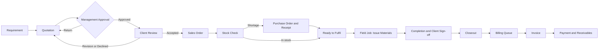

# TRACK360 ERP — Product Requirements Document

**Version:** 2.0 (full redesign)
**Product:** TRACK360 ERP by ESSPL
**Model:** One platform, one login, four workspaces, one connected record chain
**Scale target:** 1,000+ named users, 300+ concurrent, multi-branch
**Audience:** Management, product owners, engineering, QA, operations, AI coding agents

---

## 1. Vision

TRACK360 is the single operating system of ESSPL: from a client's first requirement to the final payment, every step lives in one platform, is linked to the step before it, and is visible to the people who need it.

Design goals, in priority order:

1. **Connected.** One client, one order, one history. Nobody re-types data between departments.
2. **Controlled.** Money and stock move only through approved gates. Every decision is audited.
3. **Simple.** Plain page names, one obvious next action, no clutter.
4. **Scalable.** Built for 1,000+ users, thousands of records per day, no slowdowns.
5. **Extensible.** New fields, approval rules, roles, and branches are configuration, not code.

Inspiration taken from Odoo: app-style modules, status bar on every record, activity log and notes on every record (chatter), smart links between related records, saved filters, global search, configurable approval rules and sequences. We take the ideas, not the complexity.

## 2. Scope

**In scope (v1 to v2 releases):** Sales, Approvals, Inventory, Purchasing, Field Service, Finance, Management and Settings, notifications, reporting, audit, multi-branch, custom fields.

**Out of scope for now:** native mobile apps, hardware barcode scanners, route planning, HR/payroll, full general-ledger accounting (Finance exports to the accounting tool instead), public customer portal beyond the secure quotation link.

## 3. What changed from v1 (removed, merged, renamed)

| Change | Reason |
|---|---|
| Removed the long "Canonical Terminology" table of 14 forbidden labels | Replaced by one short glossary (section 6) with simple names |
| Removed "Product Boundary" section | Same rule now lives in section 4 (no separate portals) |
| Removed "Approval (APR)" as a separate chain record | Approval is a log on the quotation, not another document |
| Removed "Requirement summary" and repeated service text from Client master | Requirements already hold this; avoids duplicate data |
| Removed employee search, date/time in top bar, per-page step numbers | Not useful for daily work |
| Merged "Field Reconciliation", "Material Reconciliation Record", "Return Request" into one page: **Closeout** | One concept, one name |
| Merged Quotation "financial review" and "commercial review" into one **Approval** step with rule-based levels | Fewer screens, same control |
| Renamed all "Portal" wording to plain workspace and module names | Simpler, no jargon |
| Added: configurable approval rules, branches, activities, saved filters, global search, credit notes, reorder rules, stock adjustments | Needed for an advanced system at 1,000+ users |

## 4. Users, roles, and access

### 4.1 Default roles

| Role | Key | Home workspace | Main job |
|---|---|---|---|
| Sales Officer | `csr_officer` | Sales | Clients, requirements, quotations, release orders |
| Inventory Officer | `inventory_officer` | Inventory | Stock, purchasing, receiving, field jobs, closeout |
| Finance Officer | `finance_officer` | Finance | Billing review, invoices, payments, receivables |
| Senior Management | `super_admin` | Management | Approvals, monitoring, users, settings, audit |

Role keys never change. Business-facing screens say "Senior Management", never "Super Admin".

### 4.2 Access model (3 layers, all enforced in the backend)

1. **Permissions** are action-based: `quotation.submit`, `quotation.approve`, `stock.receive`, `closeout.confirm`, `invoice.issue`, and so on. Roles are bundles of permissions. Admins can create custom roles.
2. **Record scope**: a user sees own records, own team, own branch, or all branches, as configured per role.
3. **Field visibility**: sensitive fields (purchase cost, margin) are removed by the API serializer for roles without permission.

### 4.3 Rules

1. One login page and one URL for everyone. The system opens the right workspace after sign-in and restores it after refresh.
2. Users never pick a department at login.
3. Hiding a menu is not security. Every API call is checked independently and unauthorized calls return `403`.
4. Field technicians are assignable resources inside Field Service. Optional limited technician login is a Phase 2 item, not a fifth workspace.
5. Users can belong to one or more branches. Data is filtered by branch automatically.

## 5. Modules and pages

Simple names. Every dashboard page shows its own heading.

| Workspace | Accent | Pages (in menu order) |
|---|---|---|
| **Home** (all users) | Blue | My Work, Notifications |
| **Sales** | Blue | **Sales Dashboard**, Clients, Requirements, Quotations, Sales Orders |
| **Inventory** | Teal | **Inventory Dashboard**, Products, Stock, Stock Checks, Movements, Locations |
| **Purchasing** | Teal | Vendors, Purchase Orders, Receipts |
| **Field Service** | Teal | Field Jobs, Closeouts, Teams |
| **Finance** | Amber | **Finance Dashboard**, Billing Queue, Invoices, Payments, Receivables, Reports |
| **Management** | Indigo | **Executive Dashboard**, Approvals, Users & Roles, Branches, Audit Log, Settings, System Health |

Settings contains: Approval Rules, Custom Fields, Number Sequences, Taxes & Currencies, Email Templates, Notification Rules.

A user sees only the workspaces their permissions allow. Purchasing and Field Service appear inside the Inventory workspace navigation for Inventory Officers.

## 6. Glossary (mandatory names)

| Use | Instead of |
|---|---|
| Requirement | Client Request |
| Quotation | Bill / Estimate |
| Sales Order | Order Release |
| Stock Check | Token |
| Field Job | Installer Job / Field Service Assignment |
| Issue Materials | Give Stock to Installer |
| Closeout | Installer Returns / Field Reconciliation / Return Request |
| Billing Queue | Send to Finance |
| Zero-Balance Closure | No Charge |
| Sales / Inventory / Finance / Management | CSR / Inventory / Finance / Super Admin Portal |

## 7. End-to-end flow

### Release gates (hard rules, enforced by the backend)

1. A quotation cannot go to the client before management approval.
2. A sales order cannot be released before client acceptance.
3. Inventory sees only released orders.
4. Materials cannot be issued before Stock Check passes.
5. A shortage is not ready to fulfil until goods are received.
6. A field job cannot be billed without client sign-off.
7. An invoice cannot be issued before Closeout and billing review.
8. A zero final amount creates a Zero-Balance Closure, never a payable invoice.
9. Approval must come from someone other than the quotation's preparer.

## 8. Module requirements

### 8.1 Home

- **My Work:** my activities (to-dos with due date), records waiting for my action, mentions, recent records. Same page layout for every role.
- **Notifications:** in-app real-time feed plus email. Users can mute types per rule.
- **Global search (Ctrl+K):** finds clients, quotations, orders, products, serials, invoices by number or name, filtered by permission.

### 8.2 Sales

**Sales Dashboard** — KPIs: new requirements, draft quotations, waiting for approval, returned for revision, approved and awaiting send, awaiting client decision, accepted and ready to release, orders this month. Work queue with the next action per row. Quick actions: Add Client, Record Requirement, Create Quotation.

**Clients** (single source of client data)

| Group | Fields |
|---|---|
| Type | Individual, Company, Government, NGO, Other |
| Identity | Display name; legal name and trading name (company only); industry |
| Tax | NTN, GST (company only) |
| Contacts | Multiple contacts: name, designation, email, mobile, primary flag |
| Addresses | Billing address, multiple service sites |
| Commercial defaults | Currency, payment terms, tax profile, price list |
| Owner | Account owner, branch |
| Tags | Service tags (Supply, Security, Staffing, Support, AMC, IT, Rental, Consultancy) |

Rules: duplicate check on name, phone, email, NTN; new clients searchable immediately; archive instead of delete; client page shows a smart-link bar (Requirements, Quotations, Orders, Invoices, Receivable balance).

**Requirements** — Draft, Qualified, Quoted, Closed. Client, site, service tag, description, attachments, expected date, owner. "Create Quotation" copies the requirement into a new quotation.

**Quotations**

| Section | Fields |
|---|---|
| Customer | Client, site, contact |
| Purpose | Subject, reference (tender or project), service tag, scope |
| Terms | Date, validity, payment terms, delivery, warranty |
| Currency | Currency, authorized exchange rate, rate date and source, PKR equivalent |
| Tax | Exclusive, Inclusive, None; preset or authorized custom rate |
| Lines | Product or service code, brand/model, description, unit, qty, unit price, discount, tax, total, optional image |
| Control | Prepared by, version, status, approver, comments |

Rules: catalog lines and custom lines share one calculation model; discounts above the allowed limit trigger approval; the document states exchange rates may vary at billing; every new version keeps the old one readable; expired quotations move to Expired automatically.

**Client review (secure link, not a portal):** signed, expiring, single-purpose link. Client can Accept, Request Revision, or Decline, with name and remarks recorded. Email failure never loses the quotation; the link can be copied and shared manually.

**Sales Orders:** created once from an accepted quotation (duplicate click returns the same order). Shows live fulfilment progress and links to Stock Check, Purchase Orders, Field Jobs, Invoices.

### 8.3 Approvals (in Management)

Rule-based, configurable in Settings, no code change.

- Rules by: quotation total, margin percent, discount percent, currency, client type, branch.
- One or more levels, with an approver role or named user, and a delegate when on leave.
- Actions: Approve, Return for Revision (comment required), Reject (reason required).
- Reminder and escalation after a configurable time.
- Approver sees price, cost, margin, currency, tax in one review screen.
- Audit stores approver, time, comment, version, before and after status.

### 8.4 Inventory

**Inventory Dashboard** — KPIs: incoming orders, stock checks pending, stock ready, shortages, expected deliveries, ready to fulfil, active field jobs, closeouts pending, low-stock alerts.

**Products**

- Category, brand, model, SKU, description, image, condition (New/Used).
- Tracking: Serial, IMEI, Batch, or None. Item type: Asset, Consumable, Service, Rental, License.
- Selling price, country of origin, warranty, expiry where applicable.
- Reorder rule: minimum quantity and preferred vendor. Below minimum raises a low-stock alert and a suggested purchase order.
- Custom fields (section 9.6).
- **Purchase cost** is visible only to users with `cost.view` and is never sent by the API to Sales.

**Stock:** stock on hand by product, location, batch, serial; reserved versus available; full movement ledger; stock adjustments with reason and approval; transfers between locations (Phase 2).

**Locations:** warehouse, room, rack.

**Stock Check** (created automatically when an order is released): compares required quantity against available stock; reserves available lines; sends shortage lines to a draft Purchase Order.

### 8.5 Purchasing

- **Vendors:** name, code, contacts, NTN, GST, terms, currency, categories, active state, notes, audit.
- **Purchase Orders:** Draft, Approved, Issued, Partially Received, Received, Closed, Cancelled. Vendor, terms, currency, exchange rate, tax, expected delivery, receiving location. Approval by amount rule.
- **Receipts:** actual quantity, batch or serial numbers, condition, location, evidence. Stock and ledger update exactly once per receipt. The order becomes Ready to Fulfil only when all shortages are cleared.

### 8.6 Field Service

Flow: `Ready to Fulfil -> Issue Materials -> Field Job -> Completion -> Client Sign-off -> Closeout -> Billing Queue`.

**Field Jobs:** job number, order and stock check references, client and site, assigned team or technician, planned date, issued items with serials, notes, evidence, custody history. Calendar and list views.

**Completion** per line: Installed/Delivered, Unused (returned), Consumed, Approved Extra. Client sign-off is mandatory: name, designation, time, remarks, optional signature or photo.

**Closeout:** inventory verifies issued, installed, returned quantities; condition Good, Damaged, Consumed, or Lost; approved extras; original value, deductions, extras, tax, final value. Good stock returns to available. Damaged, consumed, lost stock follows its own disposition. Closeout is locked after "Submit to Billing Queue" except via an authorized correction with reason.

**Teams:** technicians and teams as resources with availability.

### 8.7 Finance

**Finance Dashboard** — KPIs: records awaiting review, invoices ready, invoices issued this month, outstanding, paid, partially paid, overdue, sales tax; monthly billing chart; analysis by client, service tag, branch, currency.

**Billing Queue:** verified records from Closeout. Finance reviews client, quotation version, installed lines, deductions, extras, currency, tax, final amount, sign-off and evidence. Actions: Approve Billing, Return for Correction (reason required).

**Invoices:** dedicated page; same client block and line structure as the quotation; unique number; editable before issue with mandatory change reason and before/after audit; Print and Save PDF; statuses Draft, Pending Approval, Issued, Partially Paid, Paid, Overdue, Voided. **Credit Notes** (Phase 2) for post-issue corrections, since issued invoices are never rewritten.

**Payments:** record receipt, allocate to one or many invoices, payment method, reference, attachment. Payment status changes never rewrite operational history.

**Receivables:** ageing buckets (current, 1-30, 31-60, 61-90, 90+), per-client balance, reminder emails.

**Reports:** filters by period, client, service tag, region, branch, currency, invoice status. Values: excl. tax, tax, incl. tax, foreign amount, PKR equivalent, received, outstanding. Export to Excel/CSV.

### 8.8 Management

**Executive Dashboard** — approval queue, high-value and special-pricing quotations, margin exceptions, orders waiting for stock, procurement commitments, field exceptions, pending finance actions, revenue and receivables, branch comparison.

**Users & Roles:** create users, assign roles and branches, force password change, deactivate, session list, custom roles, permission matrix.

**Audit Log:** searchable by user, record, action, date, correlation ID. Append-only.

**System Health:** queue backlog, failed emails, failed jobs, recent errors, last backup time.

## 9. Platform features (apply to every record type)

1. **Status bar:** every record shows its status path at the top with the current step highlighted.
2. **Chatter:** timeline of notes, status changes, emails, attachments, and audit facts on every record. Internal notes with @mentions.
3. **Activities:** assign a to-do to a person with a due date and see it in My Work.
4. **Smart links:** buttons on a record showing counts of related records (for example an order shows Stock Check, POs, Jobs, Invoices).
5. **Saved filters and views:** list, kanban (where useful), calendar (Field Jobs), and pivot reports; users save personal filters, admins publish shared ones.
6. **Import/Export:** CSV/Excel import with validation preview for clients and products; export respects permissions.
7. **Custom fields:** label, stable key, type (Text, Number, Date, Dropdown, Yes/No), applies to (Client, Product, Quotation, Purchase Order, Receipt), options, required, order, active. Validated server-side.
8. **Number sequences:** configurable prefix, year reset, and branch code per record type.
9. **Templates:** email and print templates editable by admins with safe placeholders.
10. **Attachments:** virus-scanned, size-limited, stored in object storage, permission-checked download.
11. **Multi-branch and multi-currency:** branch on every record; currencies with authorized rates and a rate history.
12. **Idempotency:** every create and irreversible action is safe to retry; duplicates return the existing record.

## 10. Status models

| Record | Statuses |
|---|---|
| Requirement | Draft, Qualified, Quoted, Closed |
| Quotation | Draft, Pending Approval, Returned, Rejected, Approved, Sent, Accepted, Declined, Expired |
| Sales Order | Released, Stock Check, Awaiting Stock, Ready to Fulfil, In Fulfilment, Awaiting Closeout, Ready to Bill, Invoiced, Closed |
| Purchase Order | Draft, Approved, Issued, Partially Received, Received, Closed, Cancelled |
| Field Job | Planned, Materials Issued, In Progress, Awaiting Sign-off, Awaiting Closeout, Closed Out, In Billing Queue, Closed |
| Invoice | Draft, Pending Approval, Issued, Partially Paid, Paid, Overdue, Voided |

Every transition stores actor, time, previous status, new status, and reason where required.

## 11. Traceability

`REQ -> QT -> SO -> CHK -> PO -> RCV -> JOB -> CLO -> INV -> PAY`

| Code | Record |
|---|---|
| REQ | Requirement |
| QT | Quotation |
| SO | Sales Order |
| CHK | Stock Check |
| PO | Purchase Order |
| RCV | Receipt |
| JOB | Field Job |
| CLO | Closeout |
| INV | Invoice |
| PAY | Payment |

Each downstream record stores its source IDs. The "Record Trail" tab on any record shows the full chain with statuses.

## 12. Non-functional requirements

### 12.1 Scale and performance

| Metric | Target |
|---|---|
| Named users | 1,000+ (design headroom to 3,000) |
| Concurrent users | 300 sustained, 500 peak |
| Peak API load | 150 requests/second |
| Read API p95 | under 300 ms |
| Write API p95 | under 600 ms |
| Dashboard load | under 2 s |
| Search results | under 500 ms |
| PDF generation | under 5 s |
| Lists | server-side pagination, indexed filters, no unbounded queries |

### 12.2 Availability and recovery

- 99.9% monthly availability for business hours.
- RPO 5 minutes, RTO 1 hour. Tested restore every quarter.
- Zero-downtime deploys. Email and reporting outages never block transactions.

### 12.3 Security

- Backend RBAC, record scope, and field-level checks on every endpoint.
- Argon2/bcrypt hashing, forced first-login change, login throttling and lockout, optional TOTP two-factor (required for Senior Management and Finance in Phase 2).
- Short-lived sessions with secure renewal, HttpOnly Secure SameSite cookies, CSRF protection.
- Encrypted transport and secrets, least-privilege database users.
- Append-only audit for approvals, stock, billing, access, configuration.

### 12.4 Data integrity

- No silent fallback to zero price or zero payable.
- Optimistic locking on concurrent edits; row locks on stock changes.
- Issued documents use immutable snapshots.

### 12.5 Usability

- Works on desktop, laptop, tablet, phone. WCAG 2.1 AA.
- Clear empty, loading, error, and success states on every page.
- Keyboard friendly, searchable selectors, unsaved-change protection.

## 13. Acceptance criteria

1. All four roles sign in from one page and land in the correct workspace; refresh keeps the workspace.
2. Unauthorized menus are hidden and unauthorized API calls return `403`.
3. A quotation cannot reach the client without approval; approver cannot be the preparer.
4. A sales order cannot be released without client acceptance, and only once.
5. Inventory sees the released order without re-entry.
6. Only shortage lines reach purchasing; purchase cost never appears in Sales APIs.
7. A receipt updates stock and ledger exactly once, even if submitted twice.
8. Materials cannot be issued before a passing Stock Check.
9. Field completion requires client sign-off.
10. Closeout restores only eligible stock and calculates the adjusted value correctly.
11. The Billing Queue shows the record automatically after Closeout.
12. Invoice edits need a reason and create an audit entry; issued invoices are corrected only by credit note (Phase 2) or void.
13. Invoice PDF and report totals match database values.
14. Each dashboard page shows its heading (Sales, Inventory, Finance, Executive Dashboard).
15. The Record Trail shows the chain from requirement to payment.
16. A load test at 300 concurrent users meets the targets in 12.1.
17. A restore test recovers to within 5 minutes of the failure point.

## 14. Roadmap

| Phase | Content |
|---|---|
| **0 Foundation** | Repo structure, CI, auth, RBAC and record scope, audit, outbox, design system shell, observability |
| **1 Core flow** | Clients, Requirements, Quotations, Approvals, Sales Orders, Stock Check, Purchasing, Receipts, Field Jobs, Closeout, Billing Queue, Invoices, Payments, four dashboards |
| **2 Advanced** | Credit notes, stock adjustments and transfers, reorder automation, technician login, two-factor, saved views, receivable reminders, imports |
| **3 Integrations** | Accounting export, barcode/QR, mobile app, e-signature provider, SMS/WhatsApp notifications |

## 15. Open decisions for management

1. Approval thresholds and levels (amount, margin, discount).
2. Branch list and whether numbering resets per branch.
3. Accounting tool for Finance export in Phase 3.
4. Whether technicians get their own limited login in Phase 2.
5. Hosting choice: company data center or cloud (does not change the design).