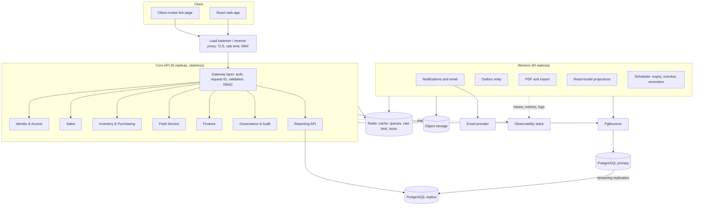

# TRACK360 ERP — Target Architecture and Infrastructure

**Version:** 2.0
**Style:** Modular platform, extraction-ready (modular monolith first, services when metrics demand)
**Stack:** React + TypeScript + Vite; Node.js + Express (TypeScript); PostgreSQL; Redis; S3-compatible storage
**Scale target:** 1,000+ named users, 300 concurrent (500 peak), 150 req/s peak

---

## 1. Architecture decision

Users see one application. Internally the backend is split by business domain with strict ownership rules.

**Decision:** deploy the domain modules as **one core API (multiple replicas) plus separate worker processes**, not as ten separate microservices on day one.

Why:

- 1,000 users is comfortably served by a well-built modular monolith. Odoo itself serves far larger deployments this way.
- The workflow is highly transactional (stock, approvals, invoices). Splitting early adds distributed-transaction risk and operations cost with no user benefit.
- Module boundaries, an outbox, and events are built from day one, so any module can be extracted later without rewriting business logic.

**Extraction triggers** (extract a module only when one is true): its scaling profile differs sharply (for example PDF or reporting), a separate team owns it, its release cadence conflicts, or its failure must be isolated. Expected first candidates: Notification, Reporting, Document generation.

## 2. Capacity model

| Item | Assumption |
|---|---|
| Named users | 1,000 (headroom to 3,000) |
| Concurrent | 300 sustained, 500 peak |
| Requests | about 0.5 req/s per active user, 150 req/s peak |
| Records per day | 5,000 to 20,000 new documents and lines |
| Ledger growth | 1 to 3 million stock movements per year |
| Attachments | 200 GB in year one |

Targets: read p95 under 300 ms, write p95 under 600 ms, dashboards under 2 s, 99.9% availability, RPO 5 min, RTO 1 h. All figures are validated by the load test in section 17.

## 3. Logical architecture



### Domain modules (inside the core API)

Each module has its own folder, database schema, routes, service layer, and event definitions. A module may call another only through its public interface or events, never by touching its tables.

| Module | Owns |
|---|---|
| Identity & Access | Users, credentials, roles, permissions, branches, sessions, two-factor |
| Sales | Clients, contacts, sites, requirements, quotations and versions, approval requests, review links, sales orders |
| Inventory & Purchasing | Products, custom attributes, vendors, locations, stock balances, reservations, serials and batches, stock checks, purchase orders, receipts, stock ledger, cost history (restricted) |
| Field Service | Field jobs, teams, material issue, completion, sign-off evidence, closeout |
| Finance | Billing queue, invoices and versions, credit notes, payments and allocations, receivables, tax and currency snapshots |
| Governance & Audit | Append-only audit, approval rules, settings history, security events |
| Platform | Notifications, chatter and activities, attachments, number sequences, custom fields, email templates, saved views |

## 4. Runtime topology

### 4.1 Production (starting point for 1,000+ users)

| Component | Count | Size (each) | Notes |
|---|---|---|---|
| Load balancer / reverse proxy | 2 | 2 vCPU, 4 GB | Nginx or Traefik, TLS, gzip/brotli, rate limit |
| Web static hosting | CDN or 2 nginx | small | Hashed assets, long cache |
| Core API | 3 | 2 vCPU, 4 GB | Stateless, auto-scale on CPU and latency |
| Workers | 2 | 2 vCPU, 4 GB | Queues scale independently |
| PgBouncer | 2 | 1 vCPU, 1 GB | Transaction pooling |
| PostgreSQL primary | 1 | 8 vCPU, 32 GB, NVMe/SSD | WAL archiving |
| PostgreSQL replica | 1 | 8 vCPU, 32 GB | Reporting reads, failover target |
| Redis | 1 primary + 1 replica (Sentinel) | 2 GB | Cache, queues, locks |
| Object storage | S3-compatible (MinIO or cloud) | 1 TB | Versioning on |
| Observability | 1 to 2 nodes | 4 vCPU, 8 GB | Prometheus, Grafana, Loki, tracing |

Sizes are starting points. Adjust after the load test. Runs on any of: containers on VMs (Docker/Swarm or Nomad), Kubernetes, or a managed cloud. The design does not depend on the choice.

### 4.2 Connection budget

3 API replicas x pool of 20 = 60, workers 2 x 10 = 20, replica reads 20. PgBouncer transaction pooling in front; PostgreSQL `max_connections` 200. Never let replicas open unbounded pools.

### 4.3 Environments

| Environment | Purpose |
|---|---|
| Local | Docker Compose: web, api, worker, postgres, redis, minio, mailhog |
| CI | Ephemeral containers for tests |
| Staging | Production-like data shape, used for load and restore tests |
| Production | As above |

## 5. Data layer

### 5.1 PostgreSQL rules

- One schema per module (`identity`, `sales`, `inventory`, `field`, `finance`, `audit`, `platform`). No cross-schema foreign keys or joins in application code; use IDs and snapshots.
- UUID primary keys (v7 preferred for index locality). Human numbers (QT-2026-000123) are display fields with unique indexes.
- Money: `numeric(18,4)`; exchange rates `numeric(18,8)`; never floats. Currency stored with every amount.
- All timestamps `timestamptz` in UTC.
- Every table: `created_at`, `updated_at`, `created_by`, `updated_by`, `version` (optimistic lock), `branch_id` where relevant.
- Soft delete or archive for master data; never delete transactional rows.
- Migrations: versioned, forward-only, reviewed, run by a deploy job, backward-compatible for one release (expand, migrate, contract).

### 5.2 Performance rules

- Index for every list filter: status, branch, client, date, owner, source reference, SKU, serial, invoice number.
- Composite indexes for common filter plus sort; partial indexes for open statuses.
- `pg_trgm` GIN indexes for name and number search.
- Keyset (cursor) pagination for large lists; offset only on small sets.
- Partition by month or year: `audit.events`, `inventory.stock_movements`, `platform.notifications`. Archive partitions older than the retention window.
- No N+1 queries. Every list endpoint has a query-plan test on seeded volume data.
- Dashboards and reports read from **read models / materialized views** on the replica, refreshed by projection workers.

### 5.3 Concurrency and integrity

- Stock changes use `SELECT ... FOR UPDATE` on the balance row inside one transaction that also writes the ledger row and outbox event.
- Reservations are atomic: check available, reserve, write movement, in one transaction.
- Status transitions are guarded by a state-machine table and `version` check; wrong-state calls return `409`.
- Advisory locks for number-sequence generation per (type, branch, year).
- `Idempotency-Key` table (key, request hash, response, expiry 24 h) for creates and irreversible actions.
- Issued documents (quotation approved version, closeout, invoice) store immutable JSON snapshots.

### 5.4 Cost and margin isolation

Purchase cost lives in a restricted table `inventory.cost_history`. The API serializer strips cost and margin unless the caller holds `cost.view`. A contract test proves Sales endpoints never return cost fields.

## 6. Caching, queues, realtime

| Need | Solution |
|---|---|
| Permission and role cache | Redis, keyed by user and permission version, invalidated on change |
| Master-data lookups (products, clients) | Short TTL cache plus ETag |
| Rate limiting | Redis sliding window per user and per IP |
| Background jobs | BullMQ on Redis: email, PDF, export, projections, reminders. Retries with backoff and jitter, dead-letter queue, replay tool |
| Realtime notifications | Server-Sent Events from the API (Redis pub/sub fan-out). WebSocket only if bidirectional need appears |
| Distributed locks | Redis locks for scheduler singletons |

Cache is an optimization only; loss of Redis must degrade performance, not correctness (queues are fed from the Postgres outbox).

## 7. Events and outbox

### 7.1 Pattern

1. A command changes state and inserts an `outbox` row in the **same database transaction**.
2. The outbox relay publishes committed rows to the queue and marks them sent.
3. Consumers record `event_id` in an `inbox` table before applying, so duplicates are ignored.
4. Cross-module workflows are state machines with compensating actions, never distributed transactions.

### 7.2 Event contract

```json
{
  "event_id": "uuid",
  "event_type": "sales-order.released.v1",
  "occurred_at": "2026-01-01T10:00:00Z",
  "source": "sales",
  "correlation_id": "uuid",
  "causation_id": "uuid",
  "actor": { "user_id": "uuid", "role": "csr_officer", "branch_id": "uuid" },
  "entity": { "type": "sales_order", "id": "uuid", "version": 3 },
  "data": {}
}
```

### 7.3 Core events

| Source | Events |
|---|---|
| Sales | `quotation.submitted`, `quotation.approved`, `quotation.returned`, `quotation.accepted`, `sales-order.released` |
| Inventory | `stock-check.completed`, `stock.shortage-detected`, `purchase-order.issued`, `receipt.posted`, `order.ready-to-fulfil`, `stock.low` |
| Field Service | `job.completed`, `closeout.confirmed`, `billing.submitted` |
| Finance | `billing.approved`, `billing.returned`, `invoice.issued`, `invoice.adjusted`, `payment.received`, `invoice.overdue` |
| Identity | `user.created`, `role.changed`, `login.failed` |

All event names are versioned (`.v1`). Breaking changes create `.v2` and run in parallel.

## 8. API standards

- Base `/api/v1/...` with resource names: `clients`, `requirements`, `quotations`, `sales-orders`, `products`, `stock`, `stock-checks`, `purchase-orders`, `receipts`, `field-jobs`, `closeouts`, `billing-queue`, `invoices`, `payments`, `users`, `audit-events`.
- Validation with Zod schemas shared between web and API from `packages/shared`.
- Envelope: `{ data, meta: { page, next_cursor, total }, error }`.
- `Idempotency-Key` header on creates and irreversible transitions; `If-Match` (version) on updates.
- Actions as sub-resources: `POST /quotations/{id}/submit`, `/approve`, `/return`, `/send`.
- Filtering, sorting, pagination server-side; max page size 200.
- Correlation ID in every response header; no raw database errors to clients.
- Error format:

```json
{ "error": { "code": "QUOTATION_APPROVAL_REQUIRED", "message": "Management approval is required before sending to the client.", "field_errors": [], "correlation_id": "uuid" } }
```

- OpenAPI spec generated and published; API contract tests run in CI.

## 9. Authentication and authorization

1. Credentials verified by Identity & Access (Argon2id). Login throttling and lockout.
2. Session: short-lived access token (15 min) in HttpOnly Secure SameSite cookie, rotating refresh token (server-stored, revocable). CSRF token on state-changing requests.
3. The token carries user ID, active role, branch scope, and `permission_version`. The gateway layer loads permissions from cache.
4. **Every** endpoint declares a required permission. A test fails the build if any route lacks one.
5. Record scope filters are applied in the data layer (own, team, branch, all), not in controllers.
6. Field-level serialization removes restricted fields (cost, margin).
7. TOTP two-factor for Senior Management and Finance (Phase 2).
8. Client review links: signed, single-purpose, expiring, rate-limited, no login.

## 10. Files and documents

- Attachments go directly to object storage through pre-signed uploads; the API stores metadata and checks size, type, and a virus scan result before marking Available.
- Downloads use short-lived signed URLs after a permission check.
- PDFs (quotation, invoice, closeout) are rendered by the document worker from stored snapshots using a headless renderer, cached by document version.
- Images are resized asynchronously and served through CDN.

## 11. Search

Phase 1: PostgreSQL full-text plus `pg_trgm` over a `platform.search_index` table fed by events (kind, number, title, subtitle, permission tags). Phase 3: move to OpenSearch only if volume or relevance requires it.

## 12. Reporting

- Read models built by projection workers from events: control tower, inventory summary, finance monthly summary, client 360, record trail.
- Heavy reports run on the replica or as background export jobs with expiring download links.
- A "Processing" state is shown when a handoff is committed but a projection is not yet ready.

## 13. Observability

- **Logs:** structured JSON with correlation ID, user ID, module, latency. No secrets or personal data.
- **Metrics (Prometheus):** request rate, latency percentiles, error rate, DB pool usage, slow queries, queue depth, outbox lag, dead-letter count, cache hit rate, login failures.
- **Business metrics:** approval age, shortage age, closeout age, invoice cycle time.
- **Tracing (OpenTelemetry):** gateway to module to database and workers.
- **Dashboards and alerts (Grafana):** p95 latency, 5xx rate, outbox lag over 60 s, dead letters over 0, replication lag over 30 s, disk over 80%, failed backups, certificate expiry.
- **System Health** page in the app reads a safe subset of these.

## 14. Resilience and disaster recovery

- Timeouts on every network call; bounded retries with exponential backoff and jitter; circuit breakers for email and storage.
- Health endpoints: liveness, readiness (DB, Redis), startup.
- Graceful shutdown drains requests and finishes in-flight jobs.
- PostgreSQL: continuous WAL archiving with base backups (pgBackRest or equivalent), point-in-time recovery, automatic failover with Patroni or managed equivalent.
- Object storage versioning and cross-zone replication.
- Backups encrypted, copied off-site, restore rehearsed quarterly with a written runbook.
- Email and reporting failure never roll back a transaction.

## 15. Security

- TLS everywhere, HSTS, secure headers, strict CORS, request size limits.
- Secrets in a secrets manager, rotated; no secrets in images or repos.
- Least-privilege DB users per module and per role (app, worker, readonly, migration).
- Dependency and container scanning in CI; signed images; SBOM.
- Audit for approvals, stock, billing, access, configuration; append-only, tamper-evident (hash chain optional).
- Input validation on every route; output encoding; upload scanning; SSRF-safe fetching.
- Regular access reviews and password/2FA policy from Management settings.

## 16. Deployment and CI/CD

Pipeline on every pull request: install, lint, typecheck, unit tests, integration tests (real Postgres and Redis in containers), API contract tests, permission-coverage test, cost-leak test, build, container scan.

Release: build immutable images, deploy to staging, run smoke and end-to-end tests, promote to production with rolling deployment (zero downtime), automatic rollback on failed health checks. Database migrations run before the new version in expand-only form.

Feature flags for risky changes. Every release has a version, changelog, and rollback plan.

## 17. Testing strategy

| Layer | Coverage |
|---|---|
| Unit | Money math, tax, currency, state machines, permission rules, serializers |
| Integration | Transactions, repositories, outbox and inbox, idempotency, stock locking |
| Contract | REST (OpenAPI) and event schemas |
| Frontend | Components, forms, conditional fields, role-based actions, responsive states |
| End to end (Playwright) | Four-role journey from requirement to payment, using unique suffixes and cleaning only its own data |
| Security | Unauthorized routes, object-level access, cost leakage, token expiry, CSRF |
| **Load (k6)** | 300 concurrent users mixed scenario for 60 minutes: p95 targets met, error rate under 0.5%, no queue growth; spike to 500; stock concurrency test with 50 parallel issues on the same product |
| Recovery | Duplicate event, provider outage, failed handoff, replay, restore drill, replica failover |

## 18. Repository structure

```
track360/
  AGENTS.md
  docs/                    PRD, design system, architecture
  apps/
    web/                   React + TypeScript + Vite
    api/                   Core API (modules/*)
    worker/                Outbox relay, notifications, documents, projections, scheduler
  packages/
    shared/                Zod schemas, permission keys, statuses, error codes, event types
    ui/                    Design-system components and tokens
    config/                ESLint, TS, Prettier configs
  infra/
    docker/                Dockerfiles, compose for local
    k8s/ or deploy/        Deployment manifests
    observability/         Prometheus, Grafana, alert rules
    k6/                    Load tests
  db/
    migrations/            Per-schema forward-only migrations
    seeds/                 Roles, permissions, demo data
```

`apps/api/src/modules/<module>/` contains `routes`, `service`, `repository`, `events`, `schema`, `permissions`, and `tests`.

Current repos `erp-1` (backend) and `erp-2` (frontend) migrate into this structure step by step, without a big-bang rewrite.

## 19. Extraction roadmap (only when triggers are met)

1. Notification worker as its own deployable (already a separate process).
2. Reporting read models and document generation as own services.
3. Identity & Access as a service (shared by everything, so extract with care).
4. Finance, then Inventory & Field Service, then Sales.

Each extraction: move schema to its own database, replace internal calls with REST or events, keep the single frontend URL.

## 20. Architecture decision records

1. One frontend, one login; workspaces are authorization and UX boundaries.
2. Modular monolith plus workers now; services when metrics require.
3. Roles are not services; module boundaries follow data ownership.
4. Postgres schema-per-module, no cross-schema joins in code.
5. Outbox and inbox for every cross-module handoff.
6. Reads for dashboards come from read models, not live cross-module joins.
7. Purchase cost restricted at the API serializer.
8. Approved documents and issued invoices use immutable snapshots.
9. Approval is a rule-driven workflow, separation of duties enforced (preparer cannot approve).
10. Cache and Redis are optimizations; Postgres is the source of truth.