so here is the flow firstly lets talk about the first table only employee_info as looking in a prototype i am seeing that we need multiple thing for employee 

1. Employee_info we need multiple things like forstly we need total employees all of them we can do it by simpleing getting all the employees in array and then get the length of it.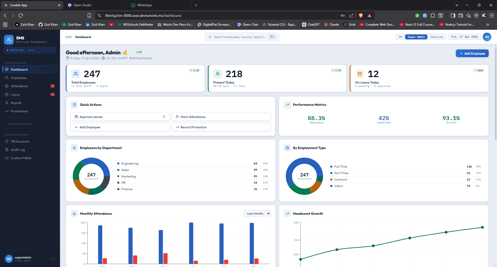
2. when creating employee we have first add the employee in employee_info table and then add the employee in job_info table. so in first employee_info table we need mutliple fields from user. (e.g) these  id uuid NOT NULL DEFAULT gen_random_uuid(),
    employee_id character varying(10) COLLATE pg_catalog."default" NOT NULL,
    name character varying(100) COLLATE pg_catalog."default" NOT NULL,
    father_name character varying(100) COLLATE pg_catalog."default" NOT NULL,
    cnic character varying(20) COLLATE pg_catalog."default" NOT NULL,
    date_of_birth character varying(15) COLLATE pg_catalog."default" NOT NULL,
    created_at timestamp with time zone DEFAULT CURRENT_TIMESTAMP,
    updated_at timestamp with time zone DEFAULT CURRENT_TIMESTAMP,
    CONSTRAINT employee_info_pkey PRIMARY KEY (id),
    CONSTRAINT employee_info_cnic_key UNIQUE (cnic),
    CONSTRAINT employee_info_employee_id_key UNIQUE (employee_id), and all are required  so we need to add https status codes for each error and  the validation for all of them. suggest if we use any library for validation  like JOI or ZOD npm package and when hr add all the field it should be validated and if there is any error it should be returned with the error message and the status code. 
    also we will not be deleting any employee data nor do all the other data ok so no deleteing methods in models service and routes for it 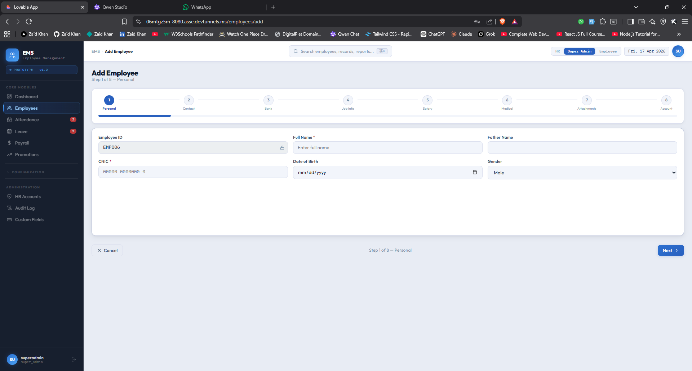
3. we have a emplyee page and where we have search field and can search employees by name and employee id and  we have a action btns first one  when clicked on it it show all the avaiable info on the empolyee all of them but in section wise like a Personal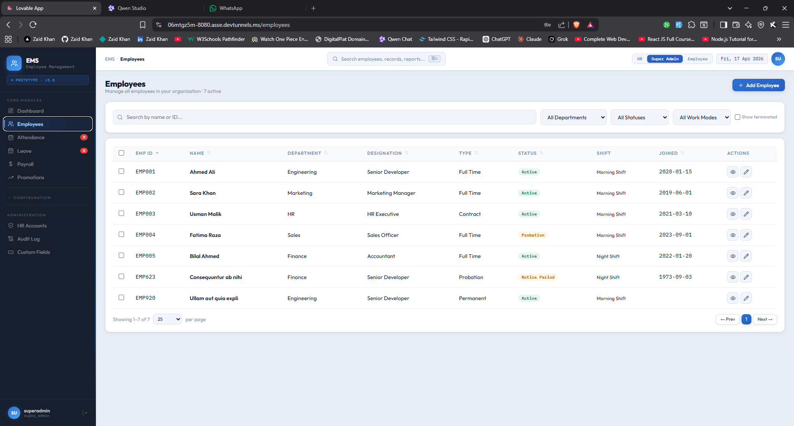
Job Info, Medical, Attendance, Leave, Payslips, Promotions, Penalties, Activity, Documents btns and clicking on that btn show only that table releated fields 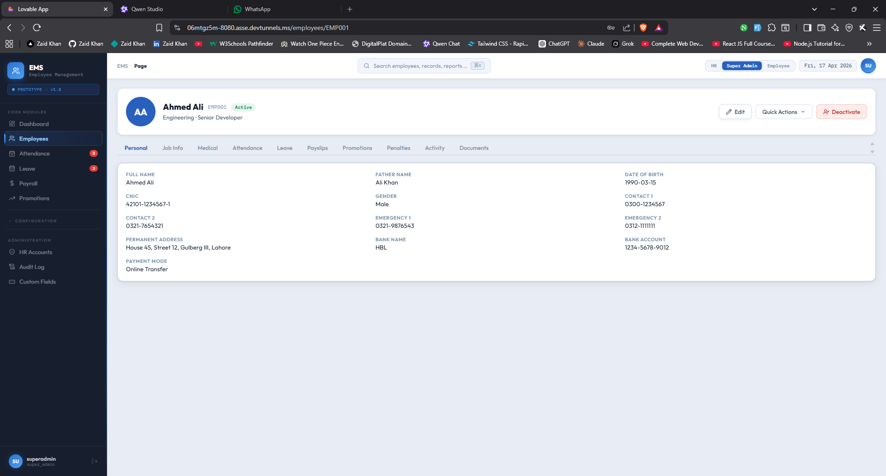. Second we can edit and the same fileds like UI will be redirect but to emplyee edit page with employee id send to the employee ID field all of it will be done by frontend logic but we need the backend supporting the logic gehind the scenes ok  also recommand and suggest do we use context API or redux toolKit for the frontend or not ok 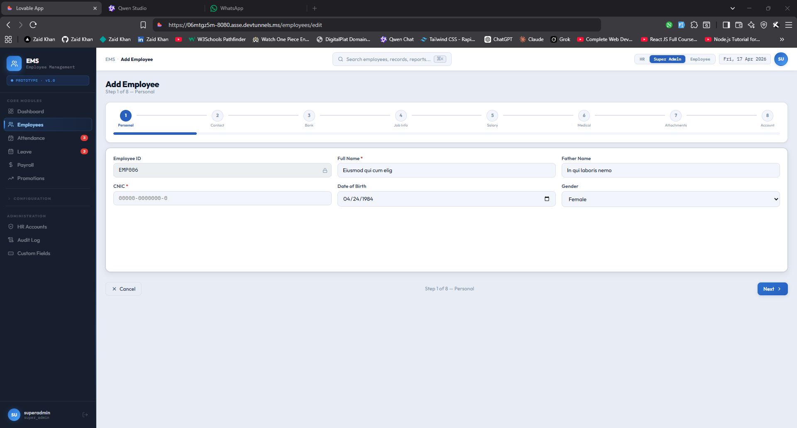
4. for attendance we need the to fetch all the employees with these fields Employee_info (name designation emp Id only these no more )	Shift (we need which shift like morrning evening or night shift)  Expected In (we need to fetch from shift table )	Check In (will also be  fetch from shift table )	Check Out (will also be  fetch from shift table )	Status (will be  enter by hr if its absent or presend if its present the other fields like checkin or out will be showen from frontend Ok)	Late  By (will be calculated expected time and checkin time if he is late then show the time in minutes or hours)	Notes only (for if he is late or absent and if someone is on their leave the reason will be automatically filled here and can't be change will be readonly )	Ack (i dont know about this one like confirmation by employee selecting this checkbox or by hr so it will be ack by Hr)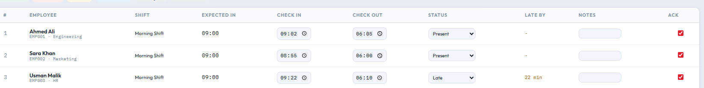 and in that same attendance page they have some button called save changes that after clicking it will send all the data of attendance to server and save it in database and if there is any error it should be returned with the error message and the status code. because if on every chechin and out we send data directly to database and hr need to change the time or a emp send a message late that i can 't come today then what so for that we have done the save changes btn.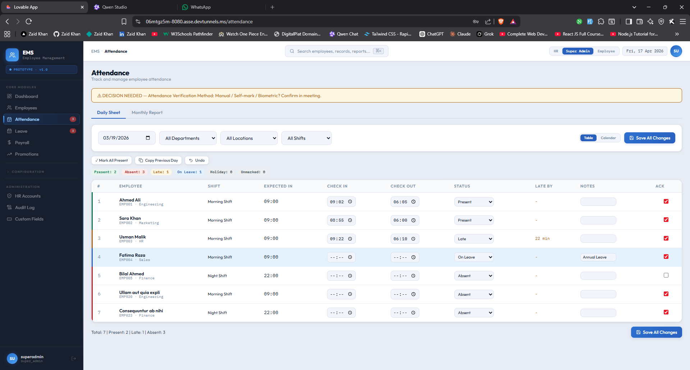
5. also we have a filtering btn's for checking attendance for the specfic date employee and department and locations and for shifts wise ok and hr can see monthly report of of attendace and for with all  employee attendace individually  with e.g Employees	Presents	Absents	Lates	Half Days	On Leaves	Totals working days 	% 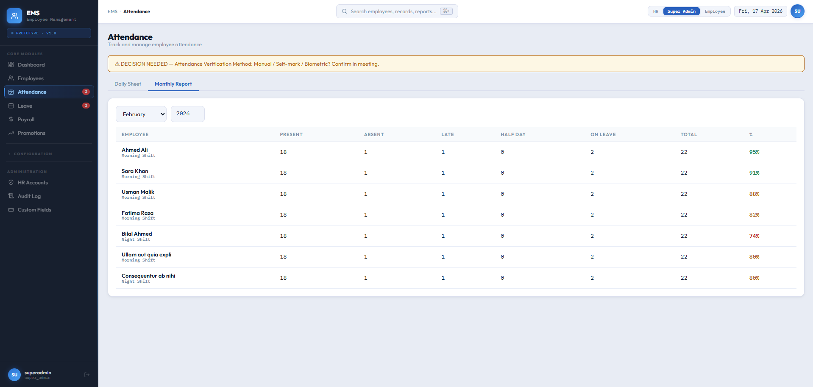
6. on leave page 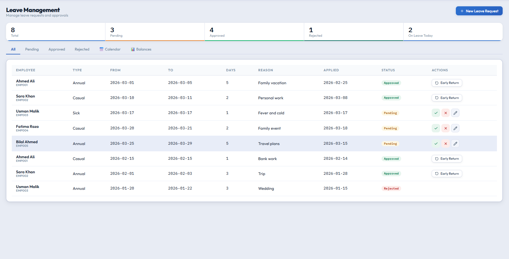 when hr click "New Leave Request" btn it will open a model 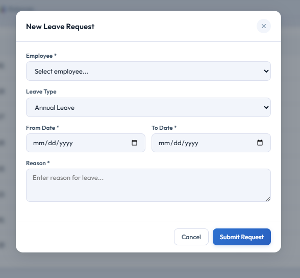 in which we have fields we can select employee by their id in back all the things are using id 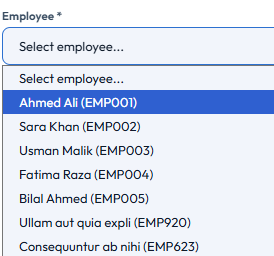 but for hr to get the correct we use the emp name + id ok  and can select from drop down leave type and data from and to date with calander and reason  and adding logic like like can't select  more leaves then in balance  in frontend and add many validtions with status codes so we dont only use 404 and 200 it will be disaster to degub whats went wrong and right ?
7. on leave page we have different selection btns e.g All, Pending, Approved, Rejected, 📅 Calendar, 📊 Balances 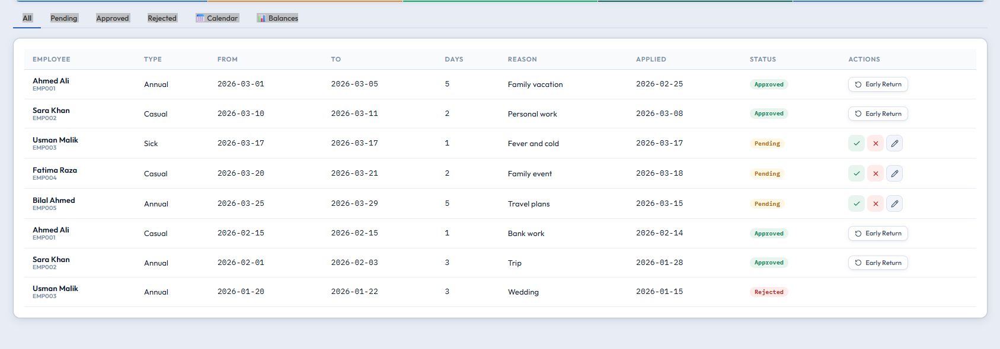  in pending we will see these fileds data Employee,	Type,	From,	To,	Days,	Reason,	Applied,	Status,	Actions 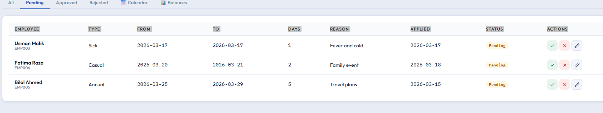 and in approved leave section we see dileds like this 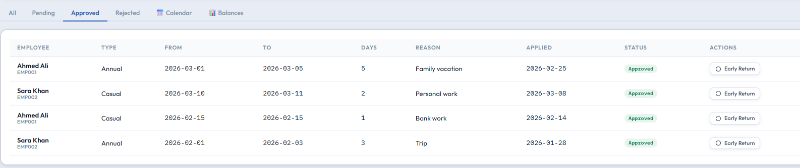 Employee = Ahmed Ali (EMP001), Type (Annual),	From (2026-03-01)	To (2026-03-05)	Days (5)	Reason (Family vacation)	Applied (2026-02-25)	Status (Approved)	
Early Return btn what this btn do? this btn do like if some employee is returned rerlt like if if applyed for 10 days annaul leave and when he booked appointments that day his flights  and hotel got deplayed and move to next date then his leave will be spent with even using them properly so where what we done we added a new field in end_by_force what is do it will act ad the final submission  if its run and by defult it only select todays date then the calculations will be calculated by this field e.g if he applyed for 10 days and is in office after 2 dat 10 - 2 = 8 he has 8 left so he go to hr say that i want to cancel my leaves so hr click this btn and this get the todays date and system calcualte the days from Days Actually Taken: 2 Days to Restore: 8 by calculating it with start_date and end_by_force date columns from DB ok.
8. and on leav oage in Rejected Section 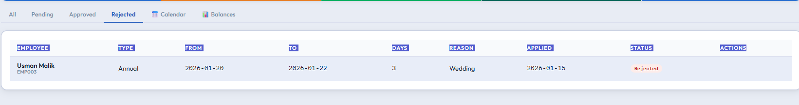 it has these fileds Employee	Type	From	To	Days	Reason	Applied	Status	Actions butn dont have any actions because its rejected 
9. and on leave page in Calander section we have 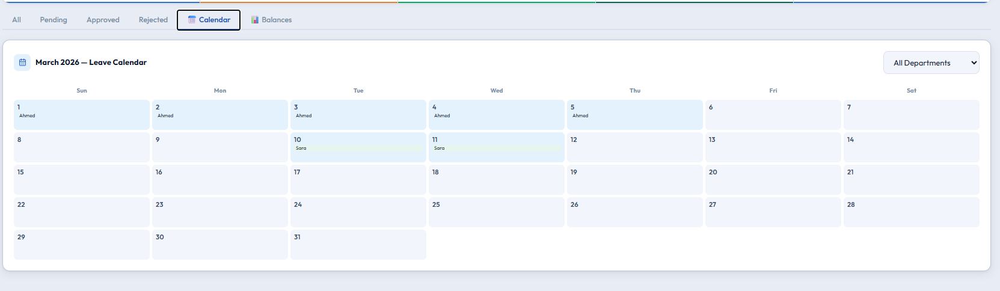 i think we dont need to do anything in the backend because if we are getting dates from the backend we have enoght with frontend logic we can create a function that accepts date and convert in into the calanders visable ok like in the image and hr can filter  all of the data with by departments  and if posssiable by any month and year 
10. on leave page in balances section 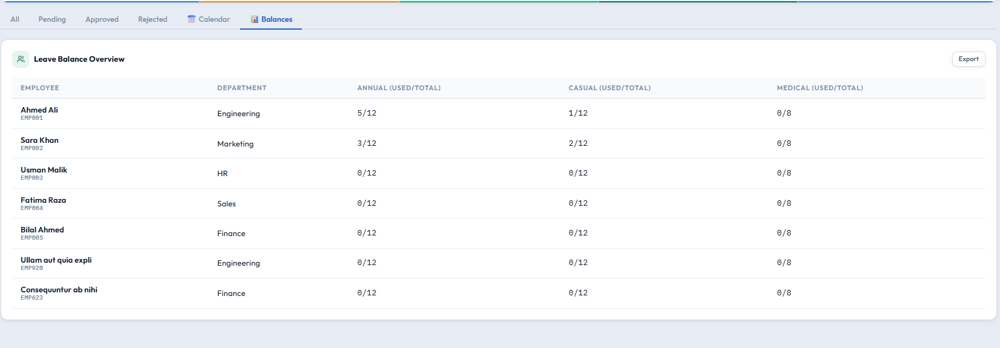 we have all employeees with filter by department and location and shift and can see the balances of all the employees like this Employee (Ahmed Ali EMP001),Department (Engineering)	Annual (used/total 5/12)	Casual (used/total 1/12)	Medical (used/total 0/8)
11. and hr or admin right now only admin can add preform CRUD these configurations tables  Departments, Designations, Job Statuses, Work Modes, Work Locations, Emp. Types, Shifts, Leave Types, Leave Policies, if some new deperament or location added then we do no other can do but 
12. right now we are doing only hr and super admin and employee must all there roles are must no compropis in that and ok Hr can do hr and with employee what can do  stuff ok but configurations will be done by super admin and also we will add more roles and permissions in the future ok 


and this is the SRS for this project but right now let leave the inventory and financial and other part let just go with the leave and attendance and employee management system ok offical announcement days and other things ok understood we are foucsing on the core functionality of the project ok the HCM Human capital Managment


``` 
ERP: Functional Blueprint V1.1
1. The Global Ecosystem (The "Shell")
Before entering any specific department, the system provides a unified experience. This ensures that even if we have a 1,000-person company, the core "Office" experience remains consistent.
A. The Multi-Module App Switcher
Logic: Upon login, the user lands on a "Launchpad."
Dynamic Access: The system checks the user’s Department and Role.
Example: If a user is in "Sales," the "Inventory" icon might be accessible but "HR Admin" and "Finance" icons will not allow the user to access them.
B. The Universal Global Sidebar
The sidebar stays with the user everywhere. It contains the "Personal Office" features:
Attendance Live-Status: A real-time indicator. If HR marks them "Present," a green check appears.
Quick Notification Center: Centralized "Push Notifications" for the web. "Your leave was approved," "New Penalty applied," or "Off day announcement.”
Self-Service Shortcuts: One-click access to apply for leave or view pay slips.
2. Module: Human Resources (The "Admin" Side)
The HR module is the "Source of Truth" for every person in the company. In a multi-branch setup, the system distinguishes between Branch HR (Data Entry) and Head Office (HO) HR (Final Authority).
Feature 1: HR Executive Dashboard (Analytics & Stats)
The Logic: HR needs a "bird's-eye view" of the company’s health across all branches.
Key Stats (KPIs):
Attendance Overview: Percentage of employees Present, Late, or Absent today (with a branch-wise toggle).
Leave Pipeline: Number of pending leave requests requiring immediate action.
Penalty Summary: Total fines collected/applied in the current month.
Staff Count: Total active employees categorized by Department and Branch.
Birthdays/Anniversaries: Upcoming employee milestones for culture building.
Feature 2: Digital Attendance Ledger (The "Master Sheet")
The Business Problem: Physical registers are hard to track and centralize across branches.
The Solution: A high-speed digital grid for Branch HR.
The Flow:
Branch-Lock Logic: Branch HR opens the daily sheet. It only lists employees assigned to their specific branch.
Entry: As people arrive, HR enters the "Check-in" time.
Late Logic: If a shift starts at 9:00 AM and HR enters 9:15 AM, the system flags the row as RED (Late) while respecting the pre-defined grace time.
Submission: At the end of the day, Branch HR "Submits" the sheet to the Head Office. Once submitted, the branch can no longer edit the data without HO permission.
Feature 3: The Penalty & Fine Engine
The Business Problem: Deductions are often forgotten or disputed at month-end.
The Solution: Immediate transparency with HO oversight.
The Flow:
Configuration: HO HR defines global "Rules" (e.g., Late arrival = 500 PKR).
Proposal: Branch HR selects a local employee and "Applies" a penalty based on the rules.
HO Approval: The penalty remains "Pending" until Head Office HR reviews it.
Real-time Alert: Once HO approves, the employee gets a notification on their sidebar. This creates a clear digital trail.
 
Feature 4: Leave & Capacity Management
The Logic: Managing "Office Capacity" to ensure departments aren't understaffed.
The Flow:
Visibility: HR sees a calendar view of who is already on leave within a specific branch or department.
Conflict Check: If too many people from one team (e.g., IT) are off, the system flags a "Capacity Alert."
Approval: HR approves/rejects based on these operational needs.
Feature 5: Unified Employee Onboarding & Credentialing
The Logic: Creating a digital identity for the whole ERP.
The Flow:
Data Entry: HR enters core details (Personal info, Medical records, Emergency contacts, Job details).
Access Provisioning: HR assigns a Branch, Department, and Role.
Automatic Account Creation: Upon saving, the system generates a unique User ID and temporary Password.
Credential Delivery: The system generates a PDF/Email for HR to give to the new hire for their first login.
Feature 6: Organization & Department Management
The Logic: Reshaping the company structure (Branches and Departments) digitally.
The Flow:
Branch Setup: HO HR adds/edits office locations (e.g., "Karachi Branch," "Lahore Branch").
Department Hierarchy: HR adds new Departments (e.g., "Operations," "Sales") and maps them to specific branches or as "Cross-Branch" entities.
Designations: Defining titles (CEO, Manager, Intern) within those departments.
 
3. Module: The Employee Portal (The "Standard User" Side)
Every person in the company—from the CEO to the Sales Executive—uses this journey.
Feature 1: Digital Attendance Verification (The "Signature")
The Flow:
1. The employee sees a notification: "HR marked you as 'Present' (Late) at 9:20 AM. Please verify."
2. The employee clicks "Verify/Acknowledge."
3. Business Logic: This acts as a digital signature. If the employee thinks HR made a mistake, they don't click verify; they go to the HR desk to fix it. This eliminates "I was actually on time" arguments during payroll.
Feature 2: Leave Self-Service & Balance Tracking
The Flow:
Balance View: Before applying, the employee sees their "Wallet." (e.g., 10 Casual Leaves remaining, 5 Sick Leaves).
Request: They fill out a form (Date + Reason).
History: They can track the status (Draft -> Pending -> Approved).
Feature 3: The Penalty Transparency Tab
The Flow: Employees can see a ledger of all fines.
Why? It builds a culture of accountability. They can see exactly why their salary might be lower this month.
Feature 4: Official Announcements
The Flow: A dedicated feed. Unlike an email that gets lost, these are "Pinned" notices. Once an employee reads it, it marks as "Read" for HR to track who has seen the memo.
Feature 5 (Global): Security & Personal Settings
The Logic: Security is a shared responsibility.
The Flow:
Users have a "Settings" icon in the Sidebar.
Password Management: Users must change their temporary password on first login and can update it anytime for security.
Profile View: Users can view (but usually not edit) their medical and personal info to ensure HR has the correct data.
Feature 6: The "Office Phonebook" (Company Directory)
The Logic: Centralizing utility contacts to stop the "Who do I call for X?" interruptions.
The Flow:
Central Directory: A searchable list of Departmental Extensions and Office Landlines (e.g., IT Support, Maintenance/Admin, HR Front Desk, Pantry/Peon Station).
Role-Based Visibility: Employees see the numbers they need. They don't see personal mobile numbers unless the contact person has marked them as "Public."
Branch-Specific View: By default, an employee sees their own branch's directory, but they can toggle to "Head Office" or "Other Branches" if they need to coordinate across locations.
Feature 7: The Employee Personal Dashboard
The Logic: The first screen an employee sees after the Launchpad. It summarizes their "Professional Health" so they don't have to navigate through menus to find basic info.
Visual Components (Widgets):
Attendance Summary: A circular progress chart or cards showing "Present Days," "Late Arrivals," and "Absent" for the current month.
Leave Wallet: A quick-view card showing remaining balances (e.g., Casual: 4 left, Sick: 2 left).
Active Penalty Alert: If a new penalty was approved by HO, a prominent alert box appears until the employee acknowledges it.
Upcoming Holidays: A countdown or list of the next 3 company-wide holidays.
My Activity Logs: A simplified feed showing recent actions (e.g., "You applied for leave yesterday," "Attendance verified at 9:10 AM").
Quick Action Buttons: Large, accessible buttons for "Apply Leave" and "View Company Directory."```